# c++面试常见问题

## 目录

- [c++面试常见问题](#c面试常见问题)
  - [目录](#目录)
  - [基础](#基础)
    - [**C++和C的区别：**](#c和c的区别)
  - [面向对象](#面向对象)
    - [面向对象三大特性：封装、继承、多态](#面向对象三大特性封装继承多态)
  - [多态、虚函数⭐⭐⭐](#多态虚函数)
    - [什么是多态？C++的多态是如何实现的？](#什么是多态c的多态是如何实现的)
    - [什么是动态绑定？](#什么是动态绑定)
    - [静态多态与动态多态区别](#静态多态与动态多态区别)
    - [虚函数的实现机制是什么？](#虚函数的实现机制是什么)
    - [那么虚函数表存放在哪里呢？](#那么虚函数表存放在哪里呢)
    - [纯虚函数和虚函数有什么区别？纯虚函数有什么作用？](#纯虚函数和虚函数有什么区别纯虚函数有什么作用)
    - [为什么基类的构造函数不能定义为虚函数？](#为什么基类的构造函数不能定义为虚函数)
    - [为什么析构函数一般写成虚函数](#为什么析构函数一般写成虚函数)
    - [虚析构与纯虚析构](#虚析构与纯虚析构)
    - [虚函数的默认参数问题，以及为什么会这样，默认参数具体存在哪个C++分区等？（雷火一、三面）](#虚函数的默认参数问题以及为什么会这样默认参数具体存在哪个c分区等雷火一三面)
    - [**在(基类的)构造函数和析构函数中调用虚函数会怎么样**？](#在基类的构造函数和析构函数中调用虚函数会怎么样)
    - [重写override的函数中包含有默认参数的情况，会发生动态绑定吗？](#重写override的函数中包含有默认参数的情况会发生动态绑定吗)
    - [补充：继承中构造和析构顺序](#补充继承中构造和析构顺序)
    - [构造函数可以抛出异常吗？](#构造函数可以抛出异常吗)
    - [析构函数可以抛出异常吗？](#析构函数可以抛出异常吗)
    - [类的6个默认成员函数](#类的6个默认成员函数)
    - [C++构造函数的初始化列表的作用](#c构造函数的初始化列表的作用)
    - [C++函数中那些不能声明为虚函数的有：](#c函数中那些不能声明为虚函数的有)
  - [内存模型、继承问题](#内存模型继承问题)
    - [C++内存模型（有哪些内存区域）？](#c内存模型有哪些内存区域)
    - [c++中对象的内存模型(布局)是怎么样的？](#c中对象的内存模型布局是怎么样的)
    - [钻石(菱形)继承存在什么问题，如何解决？](#钻石菱形继承存在什么问题如何解决)
  - [内存管理（内存分配、内存对齐）⭐⭐⭐](#内存管理内存分配内存对齐)
    - [**指针和引用的区别**](#指针和引用的区别)
      - [悬空指针与野指针](#悬空指针与野指针)
      - [一、野指针](#一野指针)
      - [二、悬空指针](#二悬空指针)
    - [拷贝构造函数的调用时机？什么时候会发生拷贝？](#拷贝构造函数的调用时机什么时候会发生拷贝)
    - [this指针](#this指针)
    - [堆和栈有什么区别？](#堆和栈有什么区别)
      - [malloc函数和alloca函数辨析](#malloc函数和alloca函数辨析)
    - [什么是内存碎片，内存碎片是在虚拟内存还是物理内存？](#什么是内存碎片内存碎片是在虚拟内存还是物理内存)
    - [内部碎片与外部碎片产生原因](#内部碎片与外部碎片产生原因)
    - [如何消除碎片文件？](#如何消除碎片文件)
    - [C++和C分别使用什么函数来做内存的分配和释放？有什么区别，能否混用？](#c和c分别使用什么函数来做内存的分配和释放有什么区别能否混用)
    - [new和malloc内部的实现方式有什么区别？](#new和malloc内部的实现方式有什么区别)
    - [new、nothrow new、operate new 、placement new](#newnothrow-newoperate-new-placement-new)
    - [被free回收的内存是立即返还给操作系统吗？](#被free回收的内存是立即返还给操作系统吗)
      - [malloc是如何实现的？](#malloc是如何实现的)
    - [什么是内存对齐(字节对齐)，为什么要做内存对齐，如何对齐？](#什么是内存对齐字节对齐为什么要做内存对齐如何对齐)
    - [内存泄漏原因](#内存泄漏原因)
  - [类型转换⭐⭐](#类型转换)
    - [**C++有哪些类型转换的方法(关键字)，各自有什么作用**？](#c有哪些类型转换的方法关键字各自有什么作用)
    - [static\_cast和dynamic\_cast的异同点](#static_cast和dynamic_cast的异同点)
  - [智能指针](#智能指针)
  - [**C++中的智能指针有哪些，各自有什么作用?**](#c中的智能指针有哪些各自有什么作用)
    - [shared\_ptr的实现原理是什么？构造函数、拷贝构造函数和赋值运算符怎么写？shared\_ptr是不是线程安全的？](#shared_ptr的实现原理是什么构造函数拷贝构造函数和赋值运算符怎么写shared_ptr是不是线程安全的)
    - [weak\_ptr是为了解决shared\_ptr的循环引用问题，那为什么不用raw ptr来解决这个问题？](#weak_ptr是为了解决shared_ptr的循环引用问题那为什么不用raw-ptr来解决这个问题)
  - [各种关键字⭐](#各种关键字)
    - [**const的作用**？指针常量和常量指针？const修饰的函数能否重载？](#const的作用指针常量和常量指针const修饰的函数能否重载)
    - [怎么修改常函数内部的数值](#怎么修改常函数内部的数值)
    - [**static的作用**？static变量什么时候初始化？](#static的作用static变量什么时候初始化)
      - [extern的作用?  ](#extern的作用--)
      - [c++调用c ](#c调用c-)
      - [c调用c++](#c调用c)
      - [一段代码c++又能c](#一段代码c又能c)
      - [explicit的作用？](#explicit的作用)
      - [constexpr的作用？](#constexpr的作用)
      - [volatile的作用？](#volatile的作用)
      - [mutable的作用？](#mutable的作用)
      - [auto和deltype的作用和区别？](#auto和deltype的作用和区别)
      - [C++中#define和const的区别](#c中define和const的区别)
  - [左值右值和构造函数](#左值右值和构造函数)
    - [什么是左值和右值，什么是右值引用，为什么要引入右值引用？](#什么是左值和右值什么是右值引用为什么要引入右值引用)
      - [**移动语义**](#移动语义)
      - [**完美转发** ](#完美转发-)
    - [为什么要自己定义拷贝构造函数？什么是深拷贝和浅拷贝？](#为什么要自己定义拷贝构造函数什么是深拷贝和浅拷贝)
    - [什么是移动构造函数，和拷贝构造函数的区别？](#什么是移动构造函数和拷贝构造函数的区别)
  - [内联](#内联)
    - [内联函数有什么作用？存不存在什么缺点？](#内联函数有什么作用存不存在什么缺点)
    - [内联函数和宏有什么区别，有了宏为什么还需要内联函数?](#内联函数和宏有什么区别有了宏为什么还需要内联函数)
    - [宏定义和const区别](#宏定义和const区别)
  - [杂项](#杂项)
    - [C++11新特性](#c11新特性)
    - [c++引用是怎样实现的？为什么？](#c引用是怎样实现的为什么)
      - [在main执行之前和之后执行的代码可能是什么？](#在main执行之前和之后执行的代码可能是什么)
    - [重载、重写和隐藏的区别](#重载重写和隐藏的区别)
    - [**C++为什么要增加override关键字？为了解决什么问题？**](#c为什么要增加override关键字为了解决什么问题)
    - [final关键字](#final关键字)
    - [Delete和Delete\[\]的区别，delete\[\]如何知道要delete多少次，在类的成员函数中能否Delete This？](#delete和delete的区别delete如何知道要delete多少次在类的成员函数中能否delete-this)
    - [class和struct区别](#class和struct区别)
    - [union和struct区别](#union和struct区别)
    - [**size\_t**](#size_t)
      - [全局变量](#全局变量)

## 基础

### **C++和C的区别：**

-   C++是面向对象的语言，而C是面向过程的语言；
-   C++引入new/delete运算符，取代了C中的malloc/free库函数；
-   C++引入引用的概念，而C中没有；
-   C++引入类的概念，而C中没有；
-   C++引入函数重载的特性，而C中没有
-   C++中有**函数重载**，而C 中没有

## 面向对象

### 面向对象三大特性：封装、继承、多态

封装：就是把客观事物封装成抽象的类，可以使某个属性只能被当前类使用，从而避免被其他类或对象进行操作——保证了安全性。也可以让使用者不必了解具体类的内部实现细节，而只需通过提供给外部的访问接口来访问类中的属性和方法——简化编程。

封装的意义：

> 保护或者防止代码（数据）被我们无意中破坏； &#x20;
> 保护成员属性，不让类以外的程序直接访问和修改；   &#x20;
> C++中可以给成员变量和成员函数定义访问级别。 &#x20;
> 公开 public：属性和方法可以在类的内部使用，也可以被继承，也可以在类的外部使用 &#x20;
> 保护 protect：属性和方法可以在类的内部使用，可以被继承，但不可以在类的外部使用 &#x20;
> 私有 private：属性和方法可以在类的内部使用，不可以被继承，也不可以在类的外部使用

继承： 指的是可以让某个类型的对象获得另一个类型的对象的属性的方法，继承可以使得子类沿用父类的成员（属性和方法），而无需重新编写原来的类并且可以对父类的成员（属性和方法）进行扩展。&#x20;

继承的特点：

> 子类可以继承父类非私有成员。 &#x20;
> 子类可以有自己特有的成员，并不会把父类的成员复制给子类，而去引用。 &#x20;
> 子类可以重写父类的方法，而重新定义了父类中的方法，叫做重写 &#x20;
> 子类可以在父类提供方法的基础上，额外新增一些功能。 &#x20;
> 子类无法继承父类的构造方法。 &#x20;
> 子类不能继承父类中不符合访问权限的成员。

多态：

接口的多种不同的实现方式即为多态——接口重用！

多态是以封装和继承为基础的，多态分为静态多态和动态多态。静态多态是通过重载和模板技术实现的，在编译期间确定；动态多态是通过虚函数和继承关系实现的，执行动态绑定，在运行期间确定。

## 多态、虚函数⭐⭐⭐

### 什么是多态？C++的多态是如何实现的？

答：所谓多态，就是同一个函数名具有多种状态，或者说**一个接口具有不同的行为**；

C++的多态分为**编译时多态(静态多态)和运行时多态**（动态多态），编译时多态也称为为**静态**多态，通过**重载和模板**来实现，运行时多态称为**动态多态**，通过**继承和虚函数**来实现。

### 什么是动态绑定？

动态绑定是指在执行期间（非编译期）判断所引用对象的实际类型，根据其实际的类型调用其相应的方法。

### 静态多态与动态多态区别

静态多态和动态多态区别：

-   静态多态的函数地址早绑定 - 编译阶段确定函数地址
-   动态多态的函数地址晚绑定 - 运行阶段确定函数地址

**动态多态满足条件：**

-   基类写有virtual关键字
-   有继承关系
-   子类重写父类中的虚函数

多态使用条件

-   父类指针或引用指向子类对象

当我们使用基类的引用或指针来调用基类中定义的虚函数时，直到运行时才会决定执行哪个版本。判断的依据是引用或指针绑定的对象的真实类型。

实践测试：

经测试多态在使用过程中满足如下特点：

1、基类指针或者引用只能访问基本本身所具有的变量或函数。若想使用子类的变量或函数可以在子类重写的虚函数中所用

2、基类调用虚函数的版本是根据绑定的对象决定的

### 虚函数的实现机制是什么？

【参考资料】:《游戏引擎架构》P115、 [https://zhuanlan.zhihu.com/p/98776075](https://zhuanlan.zhihu.com/p/98776075 "https://zhuanlan.zhihu.com/p/98776075")

答：虚函数是通过虚函数表来实现的，虚函数表包含了一个类(所有)的虚函数的地址，在有虚函数的类对象中，它内存空间的头部会有一个虚函数表指针(虚表指针)，用来管理虚函数表。当子类对象对父类虚函数进行重写的时候，虚函数表的相应虚函数地址会发生改变，改写成这个虚函数的地址，当我们用一个父类的指针来操作子类对象的时候，它可以指明实际所调用的函数。

-   虚函数调用是在编译时确定还是运行时确定的？如何确定调用哪个函数？

答：运行时确定，通过查找虚函数表中的函数地址确定。

-   虚函数表是存在类中还是类对象中（即是否共享虚表）？

答：存在类中，同的类不同对象共享一张虚函数表(为了节省内存空间)。&#x20;

&#x20;补充：虚函数指针是在对象中的。

### 那么虚函数表存放在哪里呢？

答：虚函数个数在编译期就可以确定，因此**虚函数表在编译期就可以确定**，程序的内存空间有代码区，堆区，栈区，全局变量区，常量区，但虚表不是代码，也不是动态分配的，因此一般在全局变量区。

### 纯虚函数和虚函数有什么区别？纯虚函数有什么作用？

答案：纯虚函数就是定义了一个虚函数但并没有实现，原型后面加"=0"。包含纯虚函数的类都是抽象类，不能生成实例。

virtual void funtion1()=0

定义纯虚函数是为了实现一个接口，起到规范的作用，想要继承这个类就必须覆盖该函数。

抽象基类不可以实例化，而子类继承父类之后没有重写父类中的纯虚函数，对于子类来说，它也拥有了这些纯虚函数，所以子类也是抽象基类，因此也不能实例化。**按规定，要在子类中用常规虚函数实现这些接口**.

在很多情况下，基类本身生成对象是不合情理的。例如，动物作为一个基类可以派生出老虎、孔雀等子类，但动物本身生成对象明显不合常理。

### 为什么基类的构造函数不能定义为虚函数？

虚函数的调用依赖于虚函数表，而指向**虚函数表的指针vptr需要在构造函数中进行初始化**，所以无法调用定义为虚函数的构造函数。

另一种说法：

构造函数目的：在运行前确定所需信息

虚函数目的：动态绑定，在运行时确定信息

在构造完之后才会有基类指向不同子类的情况，因此构造函数不能为虚函数

### 为什么析构函数一般写成虚函数

由于类的多态性，基类指针可以指向派生类的对象，如果删除该基类的指针，就会调用该指针指向的派生类析构函数，而派生类的析构函数又自动调用基类的析构函数，这样整个派生类的对象完全被释放。

如果析构函数不被声明成虚函数，则编译器实施静态绑定，在删除基类指针时，只会调用基类的析构函数而不调用派生类析构函数，这样就会造成派生类对象析构不完全，造成内存泄漏。

所以将析构函数声明为虚函数是十分必要的。在实现多态时，当用基类操作派生类，在析构时防止只析构基类而不析构派生类的状况发生，要将基类的析构函数声明为虚函数。

### 虚析构与纯虚析构

多态使用时，如果子类中有属性开辟到堆区，那么父类指针在释放时无法调用到子类的析构代码。

解决方式：将父类中的析构函数改为**虚析构**或者**纯虚析构**

虚析构和纯虚析构共性：

-   可以解决父类指针释放子类对象
-   都需要有具体的函数实现

虚析构和纯虚析构区别：

-   如果是纯虚析构，该类属于抽象类，无法实例化对象

### 虚函数的默认参数问题，以及为什么会这样，默认参数具体存在哪个C++分区等？（雷火一、三面）

[https://blog.csdn.net/leigelaile1/article/details/82969693](https://blog.csdn.net/leigelaile1/article/details/82969693 "https://blog.csdn.net/leigelaile1/article/details/82969693")

### **在(基类的)构造函数和析构函数中调用虚函数会怎么样**？

【参考资料】：《Effective C++》条款9、[https://www.cnblogs.com/sylar5/p/11523992.html](https://link.zhihu.com/?target=https://www.cnblogs.com/sylar5/p/11523992.html "https://www.cnblogs.com/sylar5/p/11523992.html")

答：从语法上讲，调用没有问题，但是从效果上看，往往不能达到需要的目的（不能实现多态）；因为调用构造函数的时候，是先进行父类成分的构造，再进行子类的构造。在父类构造期间，子类的特有成分还没有被初始化，此时下降到调用子类的虚函数，使用这些尚未初始化的数据一定会出错；同理，调用析构函数的时候，先对子类的成分进行析构，当进入父类的析构函数的时候，子类的特有成分已经销毁，此时是无法再调用虚函数实现多态的。

### 重写override的函数中包含有默认参数的情况，会发生动态绑定吗？

**如果在基类的声明中带有默认实参值，则通过基类指针调用该函数时，就总是从函数的基类版本中接受默认实参值。**

参考：[https://zhuanlan.zhihu.com/p/224990704](https://zhuanlan.zhihu.com/p/224990704 "https://zhuanlan.zhihu.com/p/224990704")

因为默认参数的值要在编译时确定，所以是early binding，不会发生动态绑定。看《effective C++》&#x20;

### 补充：继承中构造和析构顺序

子类继承父类后，当**创建子类对象**，先调用父类构造函数，再调用子类构造函数，析构顺序与构造相反

### 构造函数可以抛出异常吗？

可以，但是构造函数抛出异常之后，对象没有构造完全，对象的生命周期结束，也不会调用对象的析构函数。

### 析构函数可以抛出异常吗？

C++标准指明析构函数不能、也不应该抛出异常。

如果对象在运行期间出现了异常，C++异常处理模型有责任清除那些由于出现异常所导致的已经失效了的对象(也即对象超出了它原来的作用域)，并释放对象原来所分配的资源， 这就是调用这些对象的析构函数来完成释放资源的任务，所以从这个意义上说，析构函数已经变成了异常处理的一部分

[https://blog.csdn.net/weixin\_43606861/article/details/115585476](https://blog.csdn.net/weixin_43606861/article/details/115585476 "https://blog.csdn.net/weixin_43606861/article/details/115585476")

### 类的6个默认成员函数

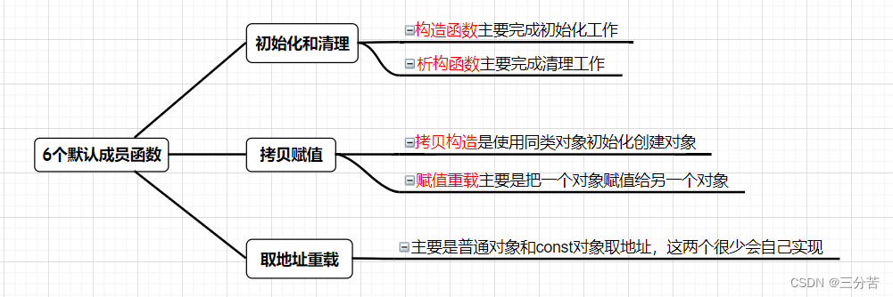

可参考链接：[https://blog.csdn.net/bit\_zyx/article/details/124825804?spm=1001.2101.3001.6650.10\&utm\_medium=distribute.pc\_relevant.none-task-blog-2\~default\~BlogCommendFromBaidu\~Rate-10-124825804-blog-98729778.pc\_relevant\_multi\_platform\_whitelistv4\&depth\_1-utm\_source=distribute.pc\_relevant.none-task-blog-2\~default\~BlogCommendFromBaidu\~Rate-10-124825804-blog-98729778.pc\_relevant\_multi\_platform\_whitelistv4\&utm\_relevant\_index=19](https://blog.csdn.net/bit_zyx/article/details/124825804?spm=1001.2101.3001.6650.10\&utm_medium=distribute.pc_relevant.none-task-blog-2~default~BlogCommendFromBaidu~Rate-10-124825804-blog-98729778.pc_relevant_multi_platform_whitelistv4\&depth_1-utm_source=distribute.pc_relevant.none-task-blog-2~default~BlogCommendFromBaidu~Rate-10-124825804-blog-98729778.pc_relevant_multi_platform_whitelistv4\&utm_relevant_index=19 "https://blog.csdn.net/bit_zyx/article/details/124825804?spm=1001.2101.3001.6650.10\&utm_medium=distribute.pc_relevant.none-task-blog-2~default~BlogCommendFromBaidu~Rate-10-124825804-blog-98729778.pc_relevant_multi_platform_whitelistv4\&depth_1-utm_source=distribute.pc_relevant.none-task-blog-2~default~BlogCommendFromBaidu~Rate-10-124825804-blog-98729778.pc_relevant_multi_platform_whitelistv4\&utm_relevant_index=19")

### C++构造函数的初始化列表的作用

[https://www.jb51.net/article/232248.htm](https://www.jb51.net/article/232248.htm "https://www.jb51.net/article/232248.htm")

二.成员变量的初始化顺序只与成员变量在类中声明的顺序有关，与初始化列表中列出的变量的顺序无关

[https://www.cnblogs.com/-citywall123/p/12902899.html](https://www.cnblogs.com/-citywall123/p/12902899.html "https://www.cnblogs.com/-citywall123/p/12902899.html")

### C++函数中那些不能声明为虚函数的有：

普通函数（非[成员函数](https://so.csdn.net/so/search?q=成员函数\&spm=1001.2101.3001.7020 "成员函数")）；静态成员函数；内联成员函数；构造函数；友元函数。

1．为什么C++不支持普通函数为虚函数？

普通函数（非成员函数）只能被overload，不能被override，声明为虚函数也没有什么意思，因此编译器会在编译时邦定函数。

2．为什么C++不支持[构造函数](https://so.csdn.net/so/search?q=构造函数\&spm=1001.2101.3001.7020 "构造函数")为虚函数？

这个原因很简单，主要是从语义上考虑，所以不支持。因为构造函数本来就是为了明确初始化对象成员才产生的，然而virtual function主要是为了再不完全了解细节的情况下也能正确处理对象。另外，virtual函数是在不同类型的对象产生不同的动作，现在对象还没有产生，如何使用virtual函数来完成你想完成的动作。（这不就是典型的悖论）

3．为什么C++不支持内联成员函数为虚函数？

其实很简单，那内联函数就是为了在代码中直接展开，减少函数调用花费的代价，虚函数是为了在继承后对象能够准确的执行自己的动作，这是不可能统一的。（再说了，inline函数在编译时被展开，虚函数在运行时才能动态的邦定函数）

4．为什么C++不支持[静态成员](https://so.csdn.net/so/search?q=静态成员\&spm=1001.2101.3001.7020 "静态成员")函数为虚函数？

这也很简单，静态成员函数对于每个类来说只有一份代码，所有的对象都共享这一份代码，他也没有要动态邦定的必要性。

5．为什么C++不支持友元函数为虚函数？

因为C++不支持友元函数的继承，对于没有继承特性的函数没有虚函数的说法。

## 内存模型、继承问题

### C++内存模型（有哪些内存区域）？

【参考资料】：[C++内存管理 - 还没放弃的老张 - 博客园 (cnblogs.com)](https://link.zhihu.com/?target=https://www.cnblogs.com/learning-zjx/p/10645659.html "C++内存管理 - 还没放弃的老张 - 博客园 (cnblogs.com)")

（1）堆，使用malloc、free动态分配和释放空间，能分配较大的内存；由低到高

（2）栈，为函数的局部变量分配内存，能分配较小的内存；由高到低

（3）全局/静态存储区用于存储全局变量和静态变量；

分为bss段和data段

bss段存储未初始化变量地址（全局和静态变量自动初始化为0）

[https://baike.baidu.com/item/BSS段/5230776?fr=aladdin](https://baike.baidu.com/item/BSS段/5230776?fr=aladdin "https://baike.baidu.com/item/BSS段/5230776?fr=aladdin")

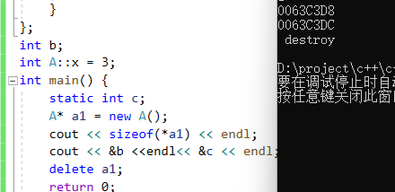

data段存储初始化变量地址：

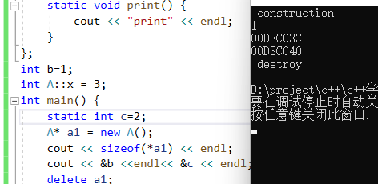

（4）常量存储区（.rodata段），专门用来存放常量；

（5）自由存储区：为堆区的抽象，通过new和delete分配和释放空间的内存，具体实现可能是堆或者内存池。

（6）代码区（.text段）

补充：堆是C和操作系统的术语，自由存储区是C++的术语，指的是通过new和delete动态分配和释放对象的抽象概念；基本上C++也会用堆区实现自由存储，但程序员可以通过重载操作符，改用其他内存实现自由存储，比如全局变量做的对象池。

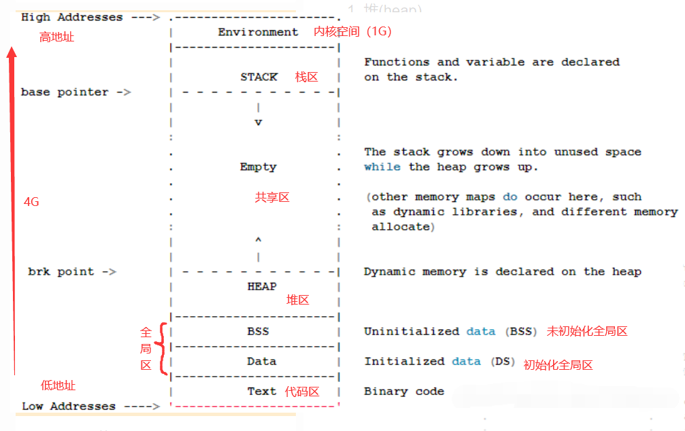

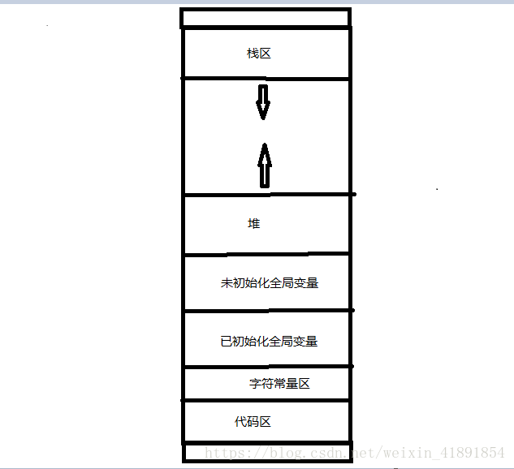

[https://www.zhihu.com/question/26224882/answer/32384814](https://www.zhihu.com/question/26224882/answer/32384814 "https://www.zhihu.com/question/26224882/answer/32384814")

### c++中对象的内存模型(布局)是怎么样的？

参考资料】：[C++内存模型 - MrYun - 博客园 (cnblogs.com)](https://link.zhihu.com/?target=https://www.cnblogs.com/yunlambert/p/9876491.html "C++内存模型 - MrYun - 博客园 (cnblogs.com)")、[C++内存布局（上）\_qinm的专栏-CSDN博客](https://link.zhihu.com/?target=https://blog.csdn.net/u012658346/article/details/50775742 "C++内存布局（上）_qinm的专栏-CSDN博客")

class的时候，会有**成员变量、成员函数、静态成员变量、静态成员函数、虚函数与纯虚函数**这几个元素。

成员变量:每个对象独有。

成员函数：存在代码区所有对象公用一份，通过this指针区分，可以通过类的空指针访问。

```c++
#include <stdio.h>
#include <iostream>
using namespace std;

class Test {
public:
    Test(){}
    ~Test() {
        std::cout << "~tets" << endl;
    }
    void print1() {
        cout << "print1" << endl;
    }
    void print2() {
        cout << "print2" << endl;
        cout << this << endl;
    }
    static void print3() {
        cout << "print3" << endl;
    }
};
int main() {
    {
        //第1种表示方法
        Test* t = nullptr;
        t->print1();
        t->print2();
        t->print3();
        Test::print3();
        //骚操作
        ((Test*)0)->print1();
    }
    cout << "imok" << endl;
    return 0;
}
```

静态成员变量、静态成员函数存在静态存储区，不能使用this指针，类共有，可以通过类访问。

综合来看影响内存的区域为**成员变量、虚函数、虚继承**

答：一般遵循以下几点原则：

（1）空类一个字节

（2）如果是有虚函数的话，虚函数表的指针始终存放在内存空间的头部；

（3）除了虚函数之外，内存空间会按照类的继承顺序(父类到子类)和字段的声明顺序布局；

（4）虚函数表中首位存放RTTI信息，随后的虚函数地址按照继承顺序排列，如果子类重写父类虚函数，都会在每一个相应的虚函数表中更新相应地址；如果子类有自己的新定义的虚函数或者非虚成员函数，也会加到第一个虚函数表的后面；

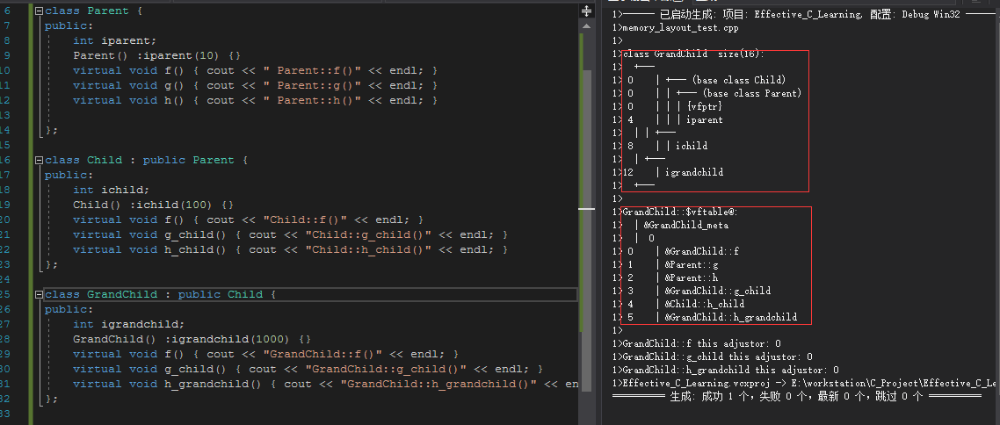

（5）如果有多继承，每个包含虚函数的基类都会有自己的虚函数表。在子类中会有多个虚函数表指针指向不同的虚函数表。另外，子类的虚函数在哪个虚函数表中是根据继承顺序决定的,而不会同时在两个虚函数表中：

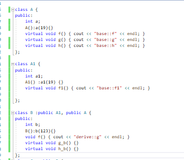

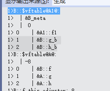

（6）如果含有钻石继承则会出现公共积累变量含有多份拷贝情况

（7）如果含有虚继承，则要包含一份虚基类指针指向虚基类表，表中含有

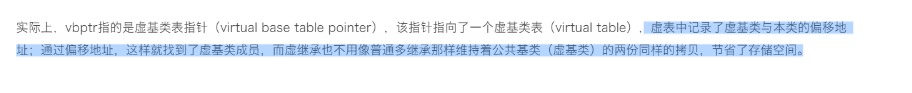

参考：

[C++虚继承实现原理（虚基类表指针与虚基类表） - 百度文库 (baidu.com)](https://wenku.baidu.com/view/edb7a65d158884868762caaedd3383c4bb4cb482.html "C++虚继承实现原理（虚基类表指针与虚基类表） - 百度文库 (baidu.com)")

（4）如果有钻石继承，并采用了虚继承，则只基类字段只有一份拷贝

（5）为了边缘对齐优化加入的padding。

### 钻石(菱形)继承存在什么问题，如何解决？

【参考资料】：[C++之钻石问题和解决方案（菱形继承问题）\_Benson的专栏-CSDN博客](https://link.zhihu.com/?target=https://blog.csdn.net/tounaobun/article/details/8443228 "C++之钻石问题和解决方案（菱形继承问题）_Benson的专栏-CSDN博客")、[**C++：钻石继承与虚继承 - Tom文星 - 博客园 (cnblogs.com)**](https://link.zhihu.com/?target=https://www.cnblogs.com/duwenxing/p/7492247.html "C++：钻石继承与虚继承 - Tom文星 - 博客园 (cnblogs.com)")

答：**菱形继承有数据冗余和数据二义性的问题**

因为两个父类会对公共基类的数据和方法产生一份拷贝，因此对于子类来说读写一个公共基类的数据或调用一个方法时，不知道是哪一个父类的数据和方法，也会导致编译错误。

可以采用虚继承的方法解决这个问题(父类继承公共基类时用virtual修饰)，这样就只会创造一份公共基类的实例，不会造成二义性。

**为什么使用虚基类和虚继承**

**• 使用虚基类和虚继承可以让一个指定的基类在继承体系中将其成员数据实例共享给从该基类直接或间接派生出的其它类，即使从不同路径继承来的同名数据成员在内存中只有一个拷贝，同一个函数名也只有一个映射**

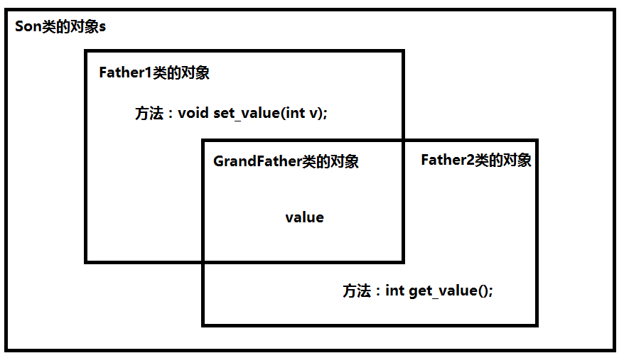

## 内存管理（内存分配、内存对齐）⭐⭐⭐

### **指针和引用的区别**

1.  指针的值可以改变，即指针可以在运行时重新指向另一个地址，但引用所绑定的对象一旦绑定就不能改变。
2.  指针占用内存空间，实质是值为地址的变量，而引用是否占内存，取决于编译器的实现。 如果编译器用指针实现引用，那么它占内存；如果编译器直接将引用替换为其所指的对象，则其不占内存。
3.  可以使用sizeof得到指针的大小，sizeof作用于引用时得到的是引用绑定的对象的大小
4.  指针可以为空，但引用必须有绑定的对象。

#### 悬空指针与野指针

#### 一、野指针

野指针是指尚未初始化的指针，既不指向合法的[内存](https://so.csdn.net/so/search?q=内存\&spm=1001.2101.3001.7020 "内存")空间，也没有使用 NULL/nullptr 初始化指针。

#### 二、悬空指针

悬空指针是指 指针指向的内存空间已被释放或不再有效。

参考：[https://blog.csdn.net/nyist\_zxp/article/details/119478944](https://blog.csdn.net/nyist_zxp/article/details/119478944 "https://blog.csdn.net/nyist_zxp/article/details/119478944")

### 拷贝构造函数的调用时机？什么时候会发生拷贝？

C++中拷贝构造函数调用时机通常有三种情况

-   使用一个已经创建完毕的对象来初始化一个新对象
-   值传递的方式给函数参数传值
-   以值方式返回局部对象

### this指针

每一个非静态成员函数只会诞生一份函数实例，也就是说多个同类型的对象会共用一块代码

那么问题是：这一块代码是如何区分那个对象调用自己的呢？

c++通过提供特殊的对象指针，this指针，解决上述问题。**this指针指向被调用的成员函数所属的对象**

this指针是隐含每一个非静态成员函数内的一种指针

this指针不需要定义，直接使用即可

this指针的用途：

-   当形参和成员变量同名时，可用this指针来区分
-   在类的非静态成员函数中返回对象本身，可使用return \*this

> ❝ this指针是一个隐含于每一个成员函数中的特殊指针。它是一个指向正在被该成员函数操作的对象，也就是要操作该成员函数的对象。this作用域是在类内部，当对一个对象调用成员函数时，编译程序先将对象的地址赋给this指针，编译器会自动将对象本身的地址作为一个隐含参数传递给函数。也就是说，即使你没有写this指针，编译器在编译的时候也是加上this的，它作为非静态成员函数的隐含形参。被调用的成员函数函数体内所有对类成员的访问，都会被转化为“this->类成员”的方式。 "

```c++
A x;
x.printInt();

```

其中，X::printInt()这个行为，在编译器中，将处理为

```c++
printInt(const X* this)

```

那么，x.printInt()调用处理将最终成为

```c++

printInt(&x);

```

### 堆和栈有什么区别？

（1）堆中的内存需要手动申请和手动释放，栈中内存是由OS自动申请和自动释放；

（2）堆能分配的内存较大（4G(32位机器)），栈能分配的内存较小（1M）；

（3）在堆中分配和释放内存会产生**内存碎片**（由malloc产生外部碎片），栈不会产生内存碎片；

内存碎片：所有的内存分配必须起始于可被 4、8 或 16 整除（视处理器体系结构而定）的地址或者因为MMU的分页机制的限制，决定内存分配算法仅能把预定大小的内存块分配给客户。假设当某个客户请求一个 43 字节的内存块时，因为没有适合大小的内存，所以它可能会获得 44字节、48字节等稍大一点的字节，因此产生的多余空间就叫内部碎片。

（4）堆的分配效率低，栈的分配效率高，可用alloca；

（5）堆地址从低向上，栈由高向下。

内存管理机制

系统有一个记录空闲内存地址的链表，当系统收到程序申请时，遍历该链表，寻找第一个空间大于申请空间的堆结点，删 除空闲结点链表中的该结点，并将该结点空间分配给程序（大多数系统会在这块内存空间首地址记录本次分配的大小，这样delete才能正确释放本内存空间，另外系统会将多余的部分重新放入空闲链表中）

只要栈的剩余空间大于所申请空间，系统为程序提供内存，否则报异常提示栈溢出。（这一块理解一下链表和队列的区别，不连续空间和连续空间的区别，应该就比较好理解这两种机制的区别了）

#### malloc函数和alloca函数辨析

**相同点**

-   `都是动态分配`，根据实际运行情况动态分配的内存，而非一开始就分配
-   `返回类型相同`，都是返回的内存起始地址
-   `内存连续`，一次调用后，分配的内存都是逻辑连续的
-   `调用相同`，输入参数都是申请内存的byte数

**不同点**

***

-   `内存分区不同`，malloc分配的是堆区内存，需要手动free；alloca分配的是栈区内存，程序自动释放；（注意，栈空间有限仅几kb左右，堆空间远大于栈空间）
-   `作用域不同`，malloc分配的内存全局可用（类似全局变量），alloca分配的内存仅当前函数可用（类似局部变量）
-   `可移植性不同`，malloc是C标准库函数\<stdlib.h>里的，可移植通用；alloca在"malloc.h"里，不具有可移植性，一般禁用

[https://zhuanlan.zhihu.com/p/449165315](https://zhuanlan.zhihu.com/p/449165315 "https://zhuanlan.zhihu.com/p/449165315")

### 什么是内存碎片，内存碎片是在虚拟内存还是物理内存？

【参考资料】：[内存碎片\_百度百科 (baidu.com)](https://link.zhihu.com/?target=https://baike.baidu.com/item/%E5%86%85%E5%AD%98%E7%A2%8E%E7%89%87/3883950 "内存碎片_百度百科 (baidu.com)")

采用分区式存储管理的系统，在储存分配过程中产生的、不能供用户作业使用的主存里的小分区称成“内存碎片”。内存碎片分为内部碎片和外部碎片。内存碎片只存在于虚拟内存上。

### 内部碎片与外部碎片产生原因

内碎片：分配给某些进程的内存区域中有些部分没用上，常见于固定分配方式

内存总量相同，100M

分页：所有的内存分配必须起始于可被 4、8 或 16 整除（视处理器体系结构而定）的地址或者因为MMU的分页机制的限制，决定内存分配算法仅能把预定大小的内存块分配给客户。假设当某个客户请求一个 43 字节的内存块时，因为没有适合大小的内存，所以它可能会获得 44字节、48字节等稍大一点的字节，因此产生的多余空间就叫内部碎片。

分段式分配，按需分配，一个程序需要45M，就给分片45MB，剩下的55M供其它程序使用，不存在内部碎片。

外碎片：内存中某些空闲区因为比较小，而难以利用上，一般出现在内存动态分配方式中

分段式分配：内存总量相同，100M，比如，内存分配依次5M，15M，50M，25M，程序运行一段时间之后，5M，15M的程序运行完毕，释放内存，其他程序还在运行，再次分配一个10M的内存供其它程序使用，只能从头开始分片，这样，就会存在10M+5M的外部碎片

### 如何消除碎片文件？

对于外部碎片，通过**紧凑技术**消除，就是操作系统不时地对进程进行移动和整理。但是这需要动态重定位寄存器地支持，且相对费时。紧凑地过程实际上类似于Windows系统中地磁盘整理程序，只不过后者是对外存空间地紧凑

解决外部内存碎片的问题就是**内存交换**。

可以把音乐程序占用的那 256MB 内存写到硬盘上，然后再从硬盘上读回来到内存里。不过再读回的时候，我们不能装载回原来的位置，而是紧紧跟着那已经被占用了的 512MB 内存后面。这样就能空缺出连续的 256MB 空间，于是新的 200MB 程序就可以装载进来。

回收内存时要尽可能地将相邻的空闲空间合并。

### C++和C分别使用什么函数来做内存的分配和释放？有什么区别，能否混用？

C使用malloc/free，C++使用new/delete，前者是C语言中的库函数，后者是C++语言的运算符，对于自定义对象，malloc/free只进行分配内存和释放内存，无法调用其构造函数和析构函数，只有new/delete能做到，完成对象的空间分配和初始化，以及对象的销毁和释放空间，不能混用，具体区别如下：

（1）new分配内存空间无需指定分配内存大小，malloc需要；

（2）new返回类型指针，类型安全，malloc返回void \*，再强制转换成所需要的类型；

（3）new是从自由存储区获得内存，malloc从堆中获取内存；

（4）对于类对象，new会调用构造函数和析构函数，malloc不会（核心）。

### new和malloc内部的实现方式有什么区别？

（1）new是运算符，malloc是C/C++语言标准库函数

（2）new一个对象的时候内部分成三步：1、调用operator new()函数分配内存  2、用构造函数初始化对象  3、返回地址；而malloc只是机械的分配一块内存，如果用mallco在堆区创建一个对象的话，是不会调用构造函数的，malloc返回的是一个空指针类型的地址，需要强制转换成对应类型。

（3）malloc申请空间失败时，返回的是NULL，因此使用时必须判空，new不需要，但是new需要捕获异常。

（4）new是类型安全的，malloc不是，malloc和free返回的是void类型指针（必须进行类型转换）。

（5）new自动计算要分配的空间大小，malloc需要手工计算

参考：[https://www.zhihu.com/question/30115922](https://www.zhihu.com/question/30115922 "https://www.zhihu.com/question/30115922")

### new、nothrow new、operate new 、placement new

（1）new是关键字、operate new是运算符（运算符可以重载）

（2）new失败抛出异常std::bad\_alloc而不是返回NULL

nothrow new在空间分配失败的情况下是不抛出异常，而是返回NULL

（3）假如A是一个类，那么A \* a=new A;实际上执行如下3个过程。 &#x20;
（1）调用operator new分配内存，operator new (sizeof(A)) &#x20;
（2）调用构造函数生成类对象，A::A() &#x20;
（3）返回相应指针 &#x20;
事实上，分配内存这一操作就是由operator new(size\_t)来完成的，如果类A重载了operator new，那么将调用A::operator new(size\_t )，否则调用全局::operator new(size\_t )，后者由C++默认提供。

placement new的作用：

(1)允许在一块已经分配成功的内存上重新构造对象或对象数组。placement new不用担心内存分配失败，因为它根本不分配内存，它做的唯一一件事情就是调用对象的构造函数。

(2)用定位放置new操作，既可以在栈(stack)上生成对象，也可以在堆（heap）上生成对象。如本例就是在栈上生成一个对象。

(3)palcement new的主要用途就是反复使用一块较大的动态分配的内存来构造不同类型的对象或者他们的数组

(4)placement new构造起来的对象数组，要显式的调用他们的析构函数来销毁（析构函数并不释放对象的内存），千万不要使用delete，这是因为placement new构造起来的对象或数组大小并不一定等于原来分配的内存大小，使用delete会造成内存泄漏或者之后释放内存时出现运行时错误。

链接：[https://zhuanlan.zhihu.com/p/228001107](https://zhuanlan.zhihu.com/p/228001107 "https://zhuanlan.zhihu.com/p/228001107") &#x20;

[https://zhuanlan.zhihu.com/p/390100676](https://zhuanlan.zhihu.com/p/390100676 "https://zhuanlan.zhihu.com/p/390100676")

[https://blog.csdn.net/linuxheik/article/details/80449059](https://blog.csdn.net/linuxheik/article/details/80449059 "https://blog.csdn.net/linuxheik/article/details/80449059")

### [被free回收的内存是立即返还给操作系统吗？](https://interviewguide.cn/#/Doc/Knowledge/C++/基础语法/基础语法?id=12、被free回收的内存是立即返还给操作系统吗？ "被free回收的内存是立即返还给操作系统吗？")

不是的，被free回收的内存会首先被ptmalloc使用双链表保存起来，当用户下一次申请内存的时候，会尝试从这些内存中寻找合适的返回。这样就避免了频繁的系统调用，占用过多的系统资源。同时ptmalloc也会尝试对小块内存进行合并，避免过多的内存碎片。

#### malloc是如何实现的？

malloc基本的实现原理就是维护一个内存空闲链表，当申请内存空间时，搜索内存空闲链表，找到适配的空闲内存空间，然后将空间分割成两个内存块，一个变成分配块，一个变成新的空闲块。如果没有搜索到，那么就会用sbrk()才推进brk指针来申请内存空间。

### 什么是内存对齐(字节对齐)，为什么要做内存对齐，如何对齐？

【参考资料】：《游戏引擎架构》P111、前文内存管理部分的参考资料

（1）内存对齐的**原因**：关键在于CPU存取数据的效率问题。为了提高效率，计算机从内存中取数据是按照一个固定长度的。比如在32位机上，CPU每次都是取32bit数据的，也就是4字节；若不进行对齐，要取出两块地址中的数据，进行掩码和移位等操作，写入目标寄存器内存，效率很低。内存对齐特性相当牺牲空间与提升数据读取的速度；**掌握内存对齐特性可以更好节约内存**

（2）内容：内存对齐指的是C++结构体中的数据成员，其内存地址是否为其对齐字节大小的倍数。

（3）**对齐原则**：

1）结构体变量的首地址能够被其最宽基本类型成员的对齐值所整除；

2）结构体内每一个成员的相对于起始地址的偏移量能够被该变量的大小整除；

3）结构体总体大小能够被最宽成员大小整除；如果不满足这些条件，编译器就会进行一个填充(padding)。

**（4）如何对齐：**

声明数据结构时，字节对齐的数据依次声明，然后小成员组合在一起，能省去一些浪费的空间，不要把小成员参杂声明在字节对齐的数据之间。

注意：

1.  32位系统的指针占4字节，64位系统的占8字节，
2.  该内存对齐原则适用于结构体对象和类对象

### 内存泄漏原因

-   简单地说就是申请了一块内存空间，使用完毕后没有释放掉。
-   **造成的问题：** 内存无法再使用，又无法释放，而再次使用时只能重新申请，然后重复以上过程，日积月累后系统中可用内存就会越来越少。
-   导致发生内存泄漏的操作：

    （1）new和malloc申请资源使用后，没有用delete和free释放；

    （2）子类继承父类时，父类析构函数不是虚函数;

    （3）比如文件句柄、socket、自定义资源类没有使用对应的资源释放函数;

    （4）shared\_ptr共享指针成环，造成循环引用计数，资源得不到释放。
-   **解决对策：**
    > **简单来说就是：** 谁申请，谁释放；谁知道该释放谁释放
    > （1）良好的编码习惯，使用了内存分配的函数，一旦使用完毕,要记得使用其相应的函数释放掉。
    （2）**将分配的内存的指针以**[**链表**](/jump/super-jump/word?word=链表 "链表")**的形式自行管理，使用完毕之后从**[**链表**](/jump/super-jump/word?word=链表 "链表")**中删除，程序结束时可检查改**[**链表**](/jump/super-jump/word?word=链表 "链表")**。**（快手一面）

    （3）**使用智能指针 🔥🔥🔥（面试大热点！！！）**

    （4）一些常见的工具插件可以帮助检测内存泄露，如ccmalloc、Dmalloc、Leaky、Valgrind等等。

    （5）**内存池**
-   **如何定位内存泄漏：**

    （1）查看内存的使用情况 win 任务管理器 linux ps -aux

    （2）分析代码、分析代码的工具检查malloc的调用情况

    （3）封装malloc、free，记录申请、释放的信息到日志中

## 类型转换⭐⭐

### **C++有哪些类型转换的方法(关键字)，各自有什么作用**？

【参考资料】：《C++Primer》P144/730、《Effective C++》条款27

（1）const\_cast: 把const属性去掉，即将const转换为非const（也可以反过来），const\_cast只能用于指针或引用，并且只能改变对象的底层const（顶层const，本身是const，底层const，指向对象const）；

（2）static\_cast: 隐式类型转换，可以实现C++中内置基本数据类型之间的相互转换，enum、struct、 int、char、float等，能进行类层次间的向上类型转换和向下类型转换（向下不安全，因为没有进行动态类型检查）。它不能进行无关类型(如非基类和子类)指针之间的转换，也不能作用包含底层const的对象；

（3）dynamic\_cast：动态类型转换，用于将基类的指针或引用安全地转换成派生类的指针或引用（也可以向上转换），若指针转换失败返回NULL，若引用返回失败抛出bad\_cast异常。dynamic\_cast是在运行时进行安全性检查；使用dynamic\_cast父类一定要有虚函数，否则编译不通过；

（4）reinterpret\_cast：reinterpret是重新解释的意思，此标识符的意思即为将数据的二进制形式重新解释，但是不改变其值，有着和C风格的强制转换同样的能力。它可以转化任何内置的数据类型为其他任何的数据类型，也可以转化任何指针类型为其他的类型。它甚至可以转化内置的数据类型为指针，无须考虑类型安全或者常量的情形。不到万不得已绝对不用（比较不安全）

更加详细论述请参考 [http://c.biancheng.net/view/2343.html](http://c.biancheng.net/view/2343.html "http://c.biancheng.net/view/2343.html")

### static\_cast和dynamic\_cast的异同点

答：二者都会做类型安全检查，只是static\_cast在**编译期进行类型检查**，dynamic\_cast在**运行期进行类型检查**。后者需要父类具备虚函数，而前者不需要。

## 智能指针

## **C++中的智能指针有哪些，各自有什么作用?**

【参考资料】《C++Primer》13.5.1章节

智能指针主要解决一个内存泄露的问题，它可以自动地释放内存空间。因为它本身是一个类，当函数结束的时候会调用析构函数，并由析构函数释放内存空间。智能指针分为共享指针(shared\_ptr), 独占指针(unique\_ptr)和弱指针(weak\_ptr)：

（1）shared\_ptr ，多个共享指针可以指向相同的对象，采用了引用计数的机制，当最后一个引用销毁时，释放内存空间；

（2）unique\_ptr，保证同一时间段内只有一个智能指针能指向该对象（可通过move操作来传递unique\_ptr）；

（3）weak\_ptr，用来解决shared\_ptr相互引用时的死锁问题，如果说两个shared\_ptr相互引用,那么这两个指针的引用计数永远不可能下降为0,资源永远不会释放。它是对对象的一种弱引用，不会增加对象的引用计数，和shared\_ptr之间可以相互转化，shared\_ptr可以直接赋值给它，它可以通过调用lock函数来获得shared\_ptr。

### shared\_ptr的实现原理是什么？构造函数、拷贝构造函数和赋值运算符怎么写？shared\_ptr是不是线程安全的？

（1）shared\_ptr是通过引用计数机制实现的，引用计数存储着有几个shared\_ptr指向相同的对象，当引用计数下降至0时就会自动销毁这个对象；

（2）具体实现：

1）构造函数：将指针指向该对象，引用计数置为1；

2）拷贝构造函数：将指针指向该对象，引用计数++；

3）赋值运算符：=号左边的shared\_ptr的引用计数-1，右边的shared\_ptr的引用计数+1，如果左边的引用技术降为0，还要销毁shared\_ptr指向对象，释放内存空间。

4）取地址运算符和→运算符重载，返回管理的原始指针。

（3）shared\_ptr的引用计数本身是安全且无锁的，但是它指向的对象的读写则不是，因此可以说shared\_ptr不是线程安全的。[shared\_ptr是线程安全的吗？ - 云+社区 - 腾讯云 (tencent.com)](https://link.zhihu.com/?target=https://cloud.tencent.com/developer/article/1654442 "shared_ptr是线程安全的吗？ - 云+社区 - 腾讯云 (tencent.com)")

### weak\_ptr是为了解决shared\_ptr的循环引用问题，那为什么不用raw ptr来解决这个问题？

答：一个weak\_ptr绑定到shared\_ptr之后不会增加引用计数，一旦最后一个指向对象的shared\_ptr被销毁，对象就会被释放，即使weak\_ptr指向对象，也还是会释放；raw指针，当对象销毁之后会变成悬浮指针。

## 各种关键字⭐

### **const的作用**？指针常量和常量指针？const修饰的函数能否重载？

【参考资料】：《C++Primer》2.4节

（1）修饰变量时 表示定义常量，不可修改, 因此**const对象声明时必须初始化**。

（2） 常函数：

-   成员函数后加const后我们称为这个函数为**常函数**
-   常函数内不可以修改成员属性
-   成员属性声明时加关键字mutable后，在常函数中依然可以修改，或者使用this指针

参考：[https://blog.csdn.net/qq\_36818386/article/details/80215392](https://blog.csdn.net/qq_36818386/article/details/80215392 "https://blog.csdn.net/qq_36818386/article/details/80215392")

-   this本质是指针常量（指针本身是常量，指向的内存可修改），如果想让this指向内存不可修改可以放进常函数。

（3）常对象：

-   声明对象前加const称该对象为常对象
-   常对象只能调用\*\*常函数 \*\*（自己）
-   普通对象可以调用常函数
-   不可修改普通属性成员

（4）const修饰的函数可以重载，也可以重载为非const函数，重载的非const函数可以修改数据成员。调用时会优先调用其非const的重载。

（5） 对指针来说，可以指定指针本身为const，也可以指定指针所指的数据为const，或二者同时指定为const；

（6）常量引用可以接受右值

（7）指针常量指的是该指针本身是一个常量，不能被修改，但是指针指向的对象可以被修改，常量指针指的是这个指针指向的对象是一个常量，不能被修改，但是指针本身可以被修改。这涉及到一个顶层const和底层const的概念：顶层const，本身是const，底层const，指向的对象是const

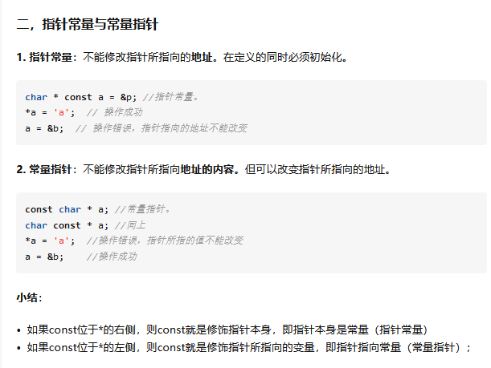

### 怎么修改常函数内部的数值

两种方法：

1、对变量加mutable

2、去掉常函数内部this指针的底层const，再修改变量

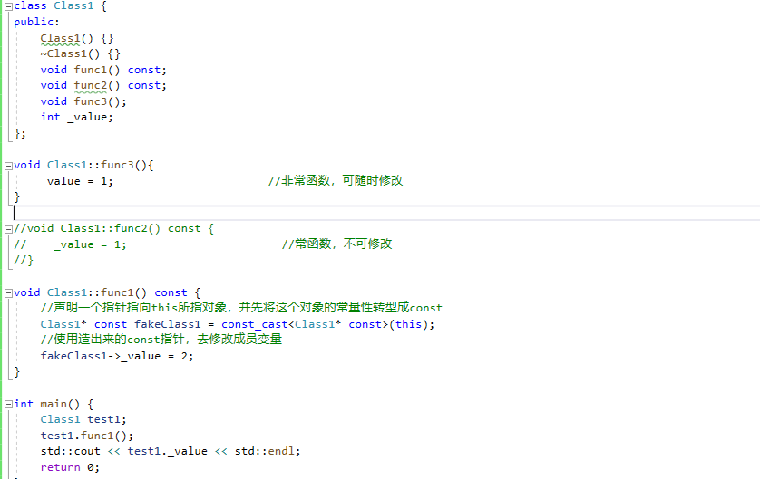

### **static的作用**？static变量什么时候初始化？

【参考资料】《游戏引擎架构》P111、《C++Primer》12.6小节、[静态变量的初始化](https://link.zhihu.com/?target=https://blog.csdn.net/hueru/article/details/89504059 "静态变量的初始化")

static即静态的意思，可以对变量和函数进行修饰。分三种情况：

（1）修饰局部变量时，使得该变量在静态存储区分配内存；只能在函数首次调用中进行首次初始化，之后函数调用不再进行初始化；其生命周期与程序相同，但其作用域为局部作用域，并不能一直被访问；

使用

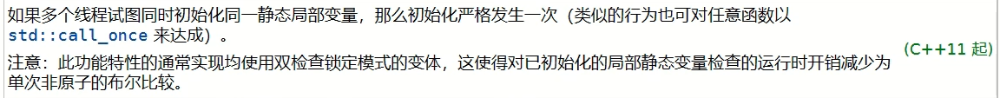

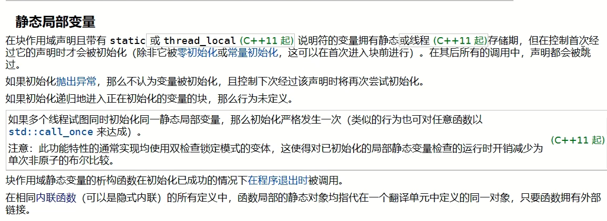

（2）**作用于文件作用域**：(在文件中直接修饰变量或函数) ,表示这些变量和函数只在本文件中可见，其他文件不可见，可以避免重定义问题

（3）**用于类成员的声明**，所有的对象都只维持一份拷贝，可以实现不同对象间的数据共享；不需要实例化对象即可访问；不能在类内部初始化，一般在外部初始化，并且初始化时不加static；

（4）**修饰成员函数时**，该函数不接受this指针，只能访问类的静态成员，不需要实例化对象即可访问。

**其它作用**：

.static的第二个作用是保持变量内容的持久。（static变量中的记忆功能和全局生存期）存储在静态数据区的变量会在程序刚开始运行时就完成初始化，也是唯一的一次初始化。。

.static的第三个作用是默认初始化为0（static变量）

#### extern的作用? &#x20;

1、全局变量如何使得整个程序可见

答：通过extern "C"，告诉g++编译器，不要对这些函数进行Name mangling，按照C编译器的方式去生成符号表符号。这样在main.c的目标文件(.o)中，编程生成的符号为c风格的，保证在链接阶段能正确访问c风格的库。如果没有extern在链接阶段的重定位过程中难以匹配

使用 extern ”C“ 的常见情况是使用第三方提供的编译好的静态链接库(.a/.lib)，动态链接库(.so/.dll)。通常我们会拿到一个头文件和对应的编译好的库文件，为了在c++中正确访问需要使用extern

[https://zhuanlan.zhihu.com/p/114669161](https://zhuanlan.zhihu.com/p/114669161 "https://zhuanlan.zhihu.com/p/114669161")

#### c++调用c&#x20;

```c++
//xx.h
extern int add(...)

//xx.c
int add(){
    
}

//xx.cpp
extern "C" {
    #include "xx.h"
}

```

#### c调用c++

```c++
//xx.h
extern "C"{
    int add();
}
//xx.cpp
int add(){    
}
//xx.c
extern int add();

```

主要差异：在C语言的头文件中，对其外部函数只能指定为extern类型，C语言中不支持extern "C"声明，在.c文件中包含了extern "C"时会出现编译语法错误。\*\*所以使用extern "C"全部都放在于cpp程序相关文件或其头文件中。

#### 一段代码c++又能c

```c++
作者：美滋滋学编程
链接：https://www.nowcoder.com/discuss/1025870
来源：牛客网

#ifdef _cplusplus
extern "C" {
#endif
    int sum(int a, int b) {
        return a + b;
    }
#ifdef _cplusplus
}
#endif

```

#### explicit的作用？

参考：[https://zhuanlan.zhihu.com/p/537536431](https://zhuanlan.zhihu.com/p/537536431 "https://zhuanlan.zhihu.com/p/537536431")

只用于修饰单参数的类构造函数,声明该构造函数必须**显式调用**，不能隐式调用；

什么是类构造函数的**隐式调用**: 当一个类具有单参构造函数时，可以直接使用赋值运算符创建类的对象，编译器会隐式调用单参构造函数进行初始化，如下所示：

#### constexpr的作用？

答：这个关键字明确的告诉编译器应该去验证(函数或变量)在编译期是否就应该是一个常数（这样编译器就可以大胆进行优化）。

#### volatile的作用？

告知编译器不要优化该变量，阻止编译器将该变量读取到寄存器而不写回, CPU读写被volatile修饰的变量时将会直接使用其内存地址，而非只是修改寄存器中的值，从而保证缓存一致性。

使用场景：当一个变量可能同时被多个线程访问且该访问不可检测和控制时，如果该变量被优化读写（缓存到寄存器），那么内存中的值被修改时寄存器中的缓存可能不会同步修改从而导致缓存不一致。 此时应使用volatile修饰该变量。

#### mutable的作用？

答：可变的意思，使类中被声明为const的函数可以修改类中的非静态成员.

#### auto和deltype的作用和区别？

答：用于实现类型自动推导，让编译器来操心变量的类型；auto不能用于函数传参和推导数组类型，但deltype可以解决这个问题。**不使用该表达式的值来初始化变量**，这是与auto的区别

#### C++中#define和const的区别

一、#define是[预处理](https://so.csdn.net/so/search?q=预处理\&spm=1001.2101.3001.7020 "预处理")指令（pre-processor directive）而const是关键字

二、#define无作用域限制而const有

三、宏（#define）可以重定义但是const不能

## 左值右值和构造函数

### 什么是左值和右值，什么是右值引用，为什么要引入右值引用？

**【参考资料】**《C++Primer》P121/471、[左值和右值\_coolwriter的博客-CSDN博客](https://link.zhihu.com/?target=https://blog.csdn.net/coolwriter/article/details/80470852 "左值和右值_coolwriter的博客-CSDN博客")

（1）

**左值**：具有可寻址的存储单元，并且能由用户改变其值的量，比如常见的变量：一个int，float，class等。左值具有持久的状态，直到离开作用域才销毁；

**右值**：表示即将销毁的临时对象，具有短暂的状态，返回非引用类型的表达式int func()等、表达式计算的结果，都会生成右值；

（2）右值引用就是必须绑定到右值的引用，可以通过&&（两个取地址符）来获得右值引用；右值引用只能绑定到即将销毁的对象或者该对象没有其他用户占用（因为是临时创建的资源，不可能被占用）因此可以自由地移动其资源；

C++11引入右值引用主要是为了实现 **移动语义**和 **完美转发**。

#### **移动语义**

为了避免临时对象的拷贝，为类增加移动构造函数。

#### **完美转发**&#x20;

就是通过一个函数将参数继续转交给另一个函数进行处理，原参数可能是右值，可能是左值，如果还能继续保持参数的原有特征，那么它就是完[美的](/jump/super-jump/word?word=美的 "美的")。

### 为什么要自己定义拷贝构造函数？什么是深拷贝和浅拷贝？

（1）拷贝构造函数的作用就是定义了当我们用同类型的另外一个对象初始化本对象的时候做了什么，在某些情况下，如果我们不自己定义拷贝构造函数，使用默认的拷贝构造函数，就会出错。比如一个类里面有一个指针，如果使用默认的拷贝构造函数，会将指针拷贝过去，即两个指针指向同个对象，那么其中一个类对象析构之后，这个指针也会被delete掉，那么另一个类里面的指针就会变成野指针（悬浮指针）；

（2）这也正是深拷贝和浅拷贝的区别，浅拷贝只是简单直接地复制指向某个对象的指针，而不复制对象本身，新旧对象还是共享同一块内存。 但深拷贝会另外创造一个一模一样的对象，新对象跟原对象不共享内存，修改新对象不会改到原对象。

浅拷贝：简单的赋值拷贝操作。
深拷贝：在堆区重新申请空间，进行拷贝操作。

总结：总结：如果**属性**有在堆区开辟的，一定要自己提供拷贝构造函数，防止浅拷贝带来的问题

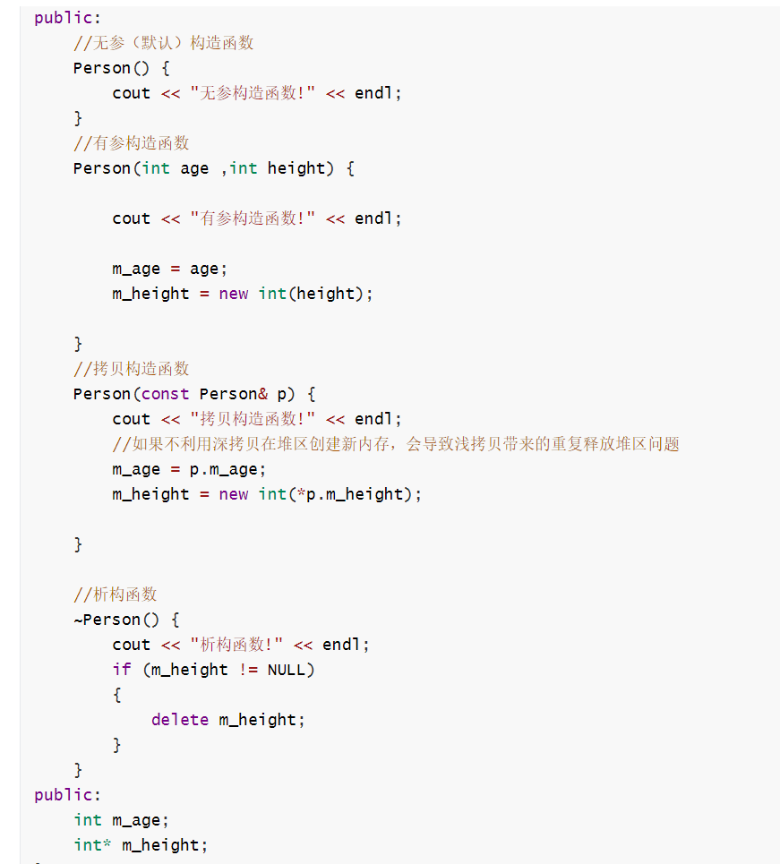

### 什么是移动构造函数，和拷贝构造函数的区别？

答：

类似拷贝构造函数，移动构造函数的第一个参数是该类类型的一个引用。 不同于拷贝构造函数的是，这个引用参数在移动构造函数中是一个 **右值引用**。 &#x20;

除了完成资源移动，移动构造函数还必须确保移后 **源对象处于这样一个状态——销毁它是无害的。** 一旦资源完成移动，**源对象必须不再指向被移动的资源——这些资源的所有权已经归属新创建的对象。**

移动构造可以减少不必要的复制，带来性能上的提升。 &#x20;

有些复制构造是必要的，我们确实需要另外一个副本；而有些复制构造是不必要的，我们可能只是希望这个对象换个地方，移动一下而已。 &#x20;

在C++11之前，如果要将源对象的状态转移到目标对象只能通过复制。 而现在在某些情况下，我们没有必要复制对象——只需要移动它们 。

## 内联

### 内联函数有什么作用？存不存在什么缺点？

1）作用是解决一些频繁调用的小函数对栈内存重复开辟所带来的消耗

（2）内联函数的缺点是可能造成代码膨胀，尤其是递归的函数，会造成大量内存开销，exe太大，占用CPU资源。此外，内联函数不方便调试，每次修改会重新编译头文件，增加编译时间。

### 内联函数和宏有什么区别，有了宏为什么还需要内联函数?

（1）define宏命令是在预处理阶段对命令进行替换，inline是在编译阶段在函数调用点处直接展开函数，节省了函数调用的开销；

（2）define的话是不会对参数的类型进行检查的，因此会出现类型安全的问题，比如定义一个max命令，但是传递的时候可能会传递一个整数和一个字符串，就会出错，但是内联函数在编译阶段会进行类型检查；

（3）增加程序体积，提高程序运行效率。空间换时间。一般很短的（10行内）函数用这个。

### 宏定义和const区别

（1）首先 宏定义是在编译的**预处理阶段**起作用，而const是在**编译、运行**时起作用

（2）其次 宏定义它**只做替换**，并**不会进行检查**，很容易报错，而const**有数据类型**，编译器会对它**进行类型检查**

（3）最后 宏定义的数据**没有分配内存**，只是**插入替换**，而const定义的变量只是值不能变，但是**会分配内存**

## 杂项

### C++11新特性

（1）auto关键字，可以自动推断出变量的类型；

（2）nullptr来代替NULL，可以避免重载时出现的问题（一个是int，一个是void \*）;

```c++
#ifndef NULL
    #ifdef __cplusplus
        #define NULL 0
    #else
        #define NULL ((void *)0)
    #endif
#endif

```

之所以c++中NULL=0是因为在c++中void\*无法隐式转化为其它类型。

但是即使这样NULL=0仍然在函数调用中会出现二义性的问题。

（3）智能指针，那三个智能指针，对内存进行管理；共享智能指针、独占智能指针、弱引用智能指针。

（4）右值引用，基于右值引用可以实现移动语义和完美转发，消除两个对象交互时不必要的对象拷贝，节省运算存储资源，提高效率；

（5）lambda表达式，可以理解为一个匿名的内联函数。

不足之处：没有CG（垃圾回收机制）、没有反射机制等。底层是仿函数，函数对象

（6）委托构造函数与继承构造函数

委托构造函数允许使用同一个类中的一个构造函数调用其它的构造函数，从而简化相关变量的初始化。

C++11 中提供的继承构造函数可以让派生类直接使用基类的构造函数，而无需自己再写构造函数，尤其是在基类有很多构造函数的情况下，可以极大地简化派生类构造函数的编写。

（7）使用using定义别名

（8）final和override两个关键字

（10）原始字面量

（11）超长整形long long

等

### c++引用是怎样实现的？为什么？

本质：**引用的本质在c++内部实现是一个指针常量.** 待补充

#### 在main执行之前和之后执行的代码可能是什么？

**main函数执行之前**，主要就是初始化系统相关资源：

-   设置栈指针
-   初始化静态`static`变量和`global`全局变量，即`.data`段的内容
-   将未初始化部分的全局变量赋初值：数值型`short`，`int`，`long`等为`0`，`bool`为`FALSE`，指针为`NULL`等等，即`.bss`段的内容
-   全局对象初始化，在`main`之前调用构造函数，这是可能会执行前的一些代码
-   将main函数的参数`argc`，`argv`等传递给`main`函数，然后才真正运行`main`函数
-   `__attribute__((constructor))`

**main函数执行之后**：

-   全局对象的析构函数会在main函数之后执行；
-   可以用 **`atexit`** 注册一个函数，它会在main 之后执行;
-   `__attribute__((destructor))`

> update1:[https://github.com/forthespada/InterviewGuide/issues/2](https://github.com/forthespada/InterviewGuide/issues/2 "https://github.com/forthespada/InterviewGuide/issues/2") ,由`stanleyguo0207`提出 - 2021.03.22

### 重载、重写和隐藏的区别

（1）重载指的是同一个名字的函数，具有不同的参数列表（参数类型、个数），或不同的返回类型，根据参数列表和返回类型决定调用哪一个函数；**同一个作用域下,函数名称相同,函数参数类型不同  或者 个数不同 或者 顺序不同**,**注意:** 函数的返回值不可以作为函数重载的条件

为什么返回值不同不可以作为重载条件（阿里2）

：函数重载以后名字不同，并且在调用的时候起作用，当返回值不同其它都相同的时候难以判断什么调用哪一个

（2）重写（覆盖）指的是，派生类中的函数重写了基类中的虚函数，重写的基类的中函数必须被声明为virtual，并且返回值，参数列表和基类中的函数一致；**函数返回值类型  函数名 参数列表 完全一致称为重写**

（3）隐藏是指，派生类中的同名函数把基类中的同名函数隐藏了，即基类同名函数被屏蔽掉；此时基类函数不能声明为virtual。**仅仅要求函数名称相同，对于返回值和形式参数不做更多要求，并且对于是否是虚函数也不做要求**

### **C++为什么要增加override关键字？为了解决什么问题？**

使得虚函数被重写时会检查虚函数签名的匹配，

虚函数签名不匹配的错误通常是因为 函数名、参数列表 或 const 属性不一样，导致意外创建了一个新的虚函数，而不是重写一个已存在的虚函数。

```c++
class Base {
public:
    virtual void Show(int x); // 虚函数
};

class Derived : public Base {
public:
    virtual void Sh0w(int x); // o 写成了 0，新的虚函数 
    virtual void Show(double x); // 参数列表不一样，新的虚函数 
    virtual void Show(int x) const; // const 属性不一样，新的虚函数 
};
//加上override后上述错误会报错


```

### final关键字

C++ 中增加了 final 关键字来限制某个类不能被继承，或者某个虚函数不能被重写。如果使用 final 修饰函数，只能修饰虚函数，并且要把final关键字放到类或者函数的后面。

如果使用 final 修饰函数，只能修饰虚函数，这样就能阻止子类重写父类的这个函数了。

如果使用 final 修饰函数，只能修饰虚函数，这样就能阻止子类重写父类的这个函数了。

```c++
class Base {
public:
    virtual void Show(int x) final; // 虚函数
};

class Derived : public Base {
public:
    virtual void Show(int x) override; // 重写提示错误  
};

```

[https://subingwen.cn/cpp/final/#1-2-修饰类](https://subingwen.cn/cpp/final/#1-2-修饰类 "https://subingwen.cn/cpp/final/#1-2-修饰类")
https://zhuanlan.zhihu.com/p/258383836

### Delete和Delete\[]的区别，delete\[]如何知道要delete多少次，在类的成员函数中能否Delete This？

**【参考资料】：**[https://blog.csdn.net/cbNotes/article/details/38900799](https://link.zhihu.com/?target=https://blog.csdn.net/cbNotes/article/details/38900799 "https://blog.csdn.net/cbNotes/article/details/38900799")、

[https://blog.csdn.net/kuimzzs/article/details/81517451](https://link.zhihu.com/?target=https://blog.csdn.net/kuimzzs/article/details/81517451 "https://blog.csdn.net/kuimzzs/article/details/81517451")

（1）**若是基本类型**，delete和delete\[]效果是一样的，因为系统会自动记录分配的空间，然后释放；

对于**自定义数据类型而言**（比如类）就不行了，delete仅仅释放数组第一个元素的内存空间，且仅调用了第一个对象的析构函数，但delete\[]会调用数组所有元素的析构函数，并释放所有内存空间；

（2）这个问题直接导致我们需要在new \[]一个对象数组时，需要保存数组的维度，C++的做法是在分配数组空间时多分配了4个字节的大小，专门保存数组的大小，这个数据应该就存在这个分配返回的指针周围，在 delete\[]时就可以取出这个保存的数，就知道了需要调用析构函数多少次了；

（3）在类的成员函数可以调用delete this，并且delete this之后还可以调用该对象的其他成员，但是有个前提：被调用的方法不涉及这个对象的数据成员和虚函数。当一个类对象声明时，系统会为其分配内存空间。在类对象的内存空间中，只有数据成员和虚函数表指针，并不包含代码内容，类的成员函数单独放在代码段中。

而malloc只是机械的分配一块内存，如果用mallco在堆区创建一个对象的话，是不会调用构造函数的

### class和struct区别

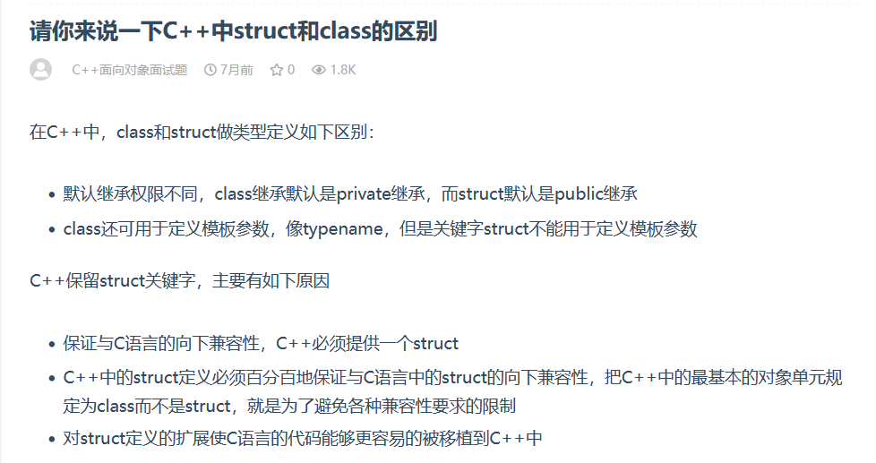

### union和struct区别

> 共用体有时也被称为联合或者联合体，这也是 Union 这个单词的本意。

结构体和共用体的区别在于：\*\*结构体的各个成员会占用不同的内存，互相之间没有影响；而共用体的所有成员占用同一段内存，修改一个成员会影响其余所有成员。  \*\*

结构体占用的内存大于等于所有成员占用的内存的总和（成员之间可能会存在缝隙），共用体占用的内存等于最长的成员占用的内存。共用体使用了内存覆盖技术，同一时刻只能保存一个成员的值，如果对新的成员赋值，就会把原来成员的值覆盖掉。

参考：[http://c.biancheng.net/view/2035.html](http://c.biancheng.net/view/2035.html "http://c.biancheng.net/view/2035.html")

### **size\_t**

size\_t类型是一个类型定义，通常将一些无符号的整形定义为size\_t，比如说unsigned int或者unsigned long，甚至unsigned long long。size\_t的每一个标准C实现会选择足够大的无符号整形来代表该平台上最大可能出现的对象大小。在诸如memcpy之类的需要获取内存中对象大小的时候，使用size\_t可以获得不同平台之间更好的兼容性。

参考:[为什么size\_t重要？（Why size\_t matters） - Jeremy's blog (jeremybai.github.io)](https://link.zhihu.com/?target=https://jeremybai.github.io/blog/2014/09/10/size-t "为什么size_t重要？（Why size_t matters） - Jeremy's blog (jeremybai.github.io)")

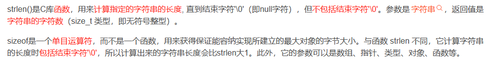

#### 全局变量

初始化：全局变量自动初始化为0，局部变量不会像全局变量那样自动初始化。

全局变量初始化顺序：

对于编译单元（同一个文件）的全局变量来讲，初始化顺序跟声明的顺序一致。销毁顺序则相反。

对于不同编译单元的全局变量，初始化顺序不确定。对于不同编译单元的全局变量互相引用的情况应避免。

解决不同文件相互引用全局变量初始化顺序不确定问题

1）可以通过函数调用，引用的时候不直接引用全局变量，而是放在一个函数中。函数中的全局变量在调用时初始化。

[http://www.manongjc.com/detail/22-fyggmcsasjbhhzb.html](http://www.manongjc.com/detail/22-fyggmcsasjbhhzb.html "http://www.manongjc.com/detail/22-fyggmcsasjbhhzb.html")
