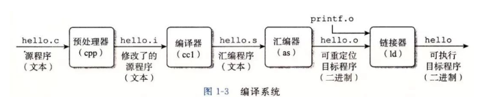
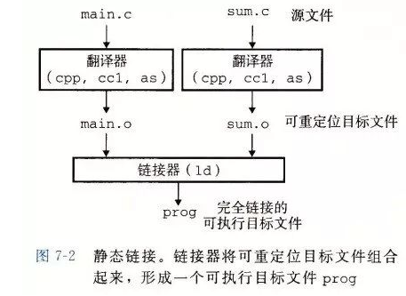
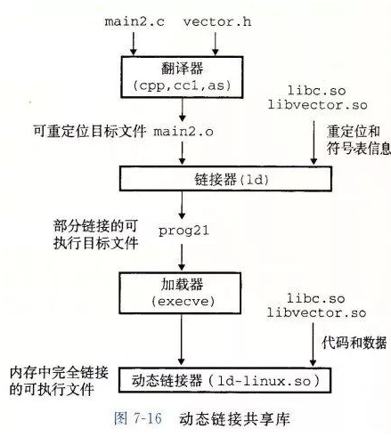
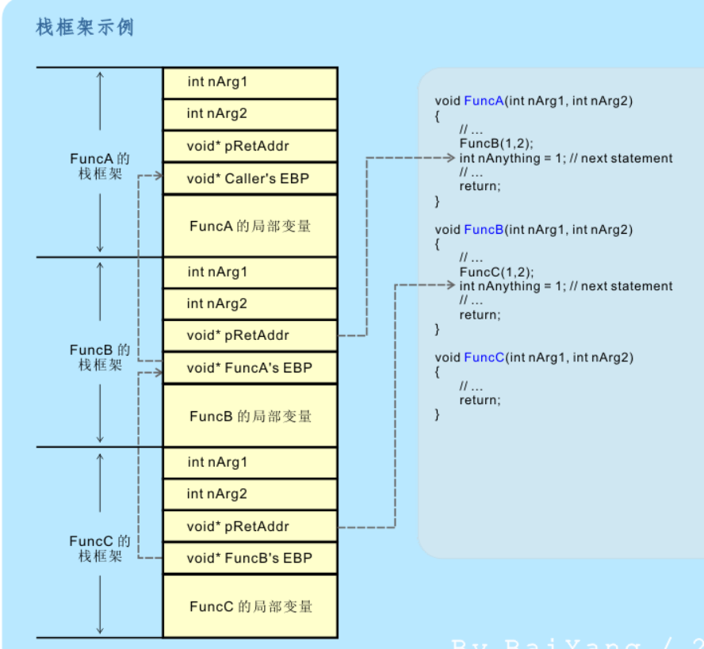
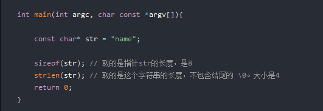

# c++面试常见问题2

## 目录

- [c++面试常见问题2](#c面试常见问题2)
  - [目录](#目录)
    - [两个线程同时i++，为什么会发生数据竟跑？](#两个线程同时i为什么会发生数据竟跑)
    - [C++从代码到可执行程序经历了什么？](#c从代码到可执行程序经历了什么)
      - [（1）预编译](#1预编译)
      - [（2）编译](#2编译)
      - [（3）汇编](#3汇编)
      - [（4）链接](#4链接)
      - [静态链接](#静态链接)
      - [动态链接](#动态链接)
      - [四种锁](#四种锁)
      - [C++之RVO返回值优化](#c之rvo返回值优化)
      - [RTTI如何实现的？C++类型信息保存在哪里？  ](#rtti如何实现的c类型信息保存在哪里--)
      - [数组按行读取和按列读取的速度差异 ](#数组按行读取和按列读取的速度差异-)
      - [32位系统new一个8G空间会怎么样](#32位系统new一个8g空间会怎么样)
      - [大端与小端](#大端与小端)
  - [**大端**](#大端)
  - [**小端**](#小端)
  - [**为什么会有大小端模式之分**](#为什么会有大小端模式之分)
  - [函数调用过程](#函数调用过程)
      - [调用约定](#调用约定)
  - [strlen和sizeof区别？](#strlen和sizeof区别)
      - [类型成员与typename](#类型成员与typename)

### 两个线程同时i++，为什么会发生数据竟跑？

这算是经典的多线程导致错误的例子吧。每本讲多线程的书都应该讲过这个例子才对吧？

i++ 看起来只有一行代码，但它不是原子操作，翻译成机器码由cpu 执行的时候会变为3步：

1: 从内存读取 i 到寄存器

2: 寄存器里的数 +1

3: 寄存器写回内存

当多线程的时候，两个线程同时走了第一步，比如 i 原值是 1，a线程把1放入自己的寄存器，b线程也把1放入自己的寄存器，然后他们分别在自己的寄存器里+1得到了2，最后2个线程都把自己的结论2写回内存，i的值就变成了2. i++ 执行了两次，结果为2，这就不对了。

甚至 a 线程稍微卡了一下，其他线程已经把 i 变成 5了，它才执行第三步，把自己寄存器里的2写回内存，那么别的线程的工作就完全被它破坏了。

所以变量涉及到多线程，就需要加锁或者使用原子操作防止错误。

[https://www.zhihu.com/question/447919345/answer/1770085770](https://www.zhihu.com/question/447919345/answer/1770085770 "https://www.zhihu.com/question/447919345/answer/1770085770") &#x20;

### [C++从代码到可执行程序经历了什么？](https://interviewguide.cn/#/Doc/Knowledge/C++/基础语法/基础语法?id=125、c从代码到可执行程序经历了什么？ "C++从代码到可执行程序经历了什么？")



#### [（1）预编译](https://interviewguide.cn/#/Doc/Knowledge/C++/基础语法/基础语法?id=（1）预编译 "（1）预编译")

主要处理源代码文件中的以“#”开头的预编译指令。处理规则见下：

1.  删除所有的#define，展开所有的宏定义。
2.  处理所有的条件预编译指令，如“#if”、“#endif”、“#ifdef”、“#elif”和“#else”。
3.  处理“#include”预编译指令，将文件内容替换到它的位置，这个过程是递归进行的，文件中包含其他 文件。
4.  删除所有的注释，“//”和“/ \*\*/”。
5.  保留所有的#pragma 编译器指令，编译器需要用到他们，如：#pragma once 是为了防止有文件被重 复引用。
6.  添加行号和文件标识，便于编译时编译器产生调试用的行号信息，和编译时产生编译错误或警告是 能够显示行号。

#### [（2）编译](https://interviewguide.cn/#/Doc/Knowledge/C++/基础语法/基础语法?id=（2）编译 "（2）编译")

把预编译之后生成的xxx.i或xxx.ii文件，进行一系列词法分析、语法分析、语义分析及优化后，生成相应 的汇编代码文件。

1.  词法分析：利用类似于“有限状态机”的算法，将源代码程序输入到扫描机中，将其中的字符序列分 割成一系列的记号。
2.  语法分析：语法分析器对由扫描器产生的记号，进行语法分析，产生语法树。由语法分析器输出的 语法树是一种以表达式为节点的树。
3.  语义分析：语法分析器只是完成了对表达式语法层面的分析，语义分析器则对表达式是否有意义进 行判断，其分析的语义是静态语义——在编译期能分期的语义，相对应的动态语义是在运行期才能确定 的语义。
4.  优化：源代码级别的一个优化过程。
5.  目标代码生成：由代码生成器将中间代码转换成目标机器代码，生成一系列的代码序列——汇编语言 表示。
6.  目标代码优化：目标代码优化器对上述的目标机器代码进行优化：寻找合适的寻址方式、使用位移 来替代乘法运算、删除多余的指令等。

#### [（3）汇编](https://interviewguide.cn/#/Doc/Knowledge/C++/基础语法/基础语法?id=（3）汇编 "（3）汇编")

将汇编代码转变成机器可以执行的指令(机器码文件)。 汇编器的汇编过程相对于编译器来说更简单，没 有复杂的语法，也没有语义，更不需要做指令优化，只是根据汇编指令和机器指令的对照表一一翻译过 来，汇编过程有汇编器as完成。经汇编之后，产生目标文件(与可执行文件格式几乎一样)xxx.o(Windows 下)、xxx.obj(Linux下)。

#### [（4）链接](https://interviewguide.cn/#/Doc/Knowledge/C++/基础语法/基础语法?id=（4）链接 "（4）链接")

将不同的源文件产生的目标文件进行链接，从而形成一个可以执行的程序。链接分为静态链接和动态链 接：

#### [静态链接](https://interviewguide.cn/#/Doc/Knowledge/C++/基础语法/基础语法?id=静态链接 "静态链接")



静态链接器以一组可重定向目标文件（二进制）为输入，生成一个完全链接的可执行目标文件作为输出。链接器主要完成以下两个任务：

-   符号解析：每个符号对应于一个函数、一个全局变量或一个静态变量，符号解析的目的是将每个符号引用与一个符号定义关联起来。
-   重定位：链接器通过把每个符号定义与一个内存位置关联起来，然后修改所有对这些符号的引用，使得它们指向这个内存位置。

**空间浪费**：因为每个可执行程序中对所有需要的目标文件都要有一份副本，所以如果多个程序对同一个 目标文件都有依赖，会出现同一个目标文件都在内存存在多个副本；

**更新困难**：每当库函数的代码修改了，这个时候就需要重新进行编译链接形成可执行程序。

**运行速度快**：但是静态链接的优点就是，在可执行程序中已经具备了所有执行程序所需要的任何东西， 在执行的时候运行速度快。

#### [动态链接](https://interviewguide.cn/#/Doc/Knowledge/C++/基础语法/基础语法?id=动态链接 "动态链接")



动态链接的基本思想是把程序按照模块拆分成各个相对独立部分，在程序运行时才将它们链接在一起形 成一个完整的程序，而不是像静态链接一样把所有程序模块都链接成一个单独的可执行文件。

**共享库**：就是即使需要每个程序都依赖同一个库，但是该库不会像静态链接那样在内存中存在多分，副 本，而是这多个程序在执行时共享同一份副本；

**更新方便**：更新时只需要替换原来的目标文件，而无需将所有的程序再重新链接一遍。当程序下一次运 行时，新版本的目标文件会被自动加载到内存并且链接起来，程序就完成了升级的目标。

**性能损耗**：因为把链接推迟到了程序运行时，所以每次执行程序都需要进行链接，所以性能会有一定损失。

#### 四种锁

法取得锁，进线程不会立刻放弃CPU时间片，而是一直循环尝试获取锁，直到获取为止。如果别的线程长时期占有锁，那么自旋就是在浪费CPU做无用功，但是自旋锁一般应用于加锁时间很短的场景，这个时候效率比较高。

#### C++之RVO返回值优化

RVO的全称是Return Value Optimization。RVO是一种[编译器](https://so.csdn.net/so/search?q=编译器\&spm=1001.2101.3001.7020 "编译器")优化技术，可以把通过函数返回创建的临时对象给”去掉”，然后可以达到少调用拷贝构造的操作目的，它是C++11标准的一部分。

[https://blog.csdn.net/u012944685/article/details/123639956](https://blog.csdn.net/u012944685/article/details/123639956 "https://blog.csdn.net/u012944685/article/details/123639956")

#### RTTI如何实现的？C++类型信息保存在哪里？ &#x20;

答：虚表开始部分是一个指向RTTICompleteObjectLocator结构体的指针，这个结构体可以帮助辨别该对象是哪个类。

#### 数组按行读取和按列读取的速度差异&#x20;

[https://www.freesion.com/article/8842222881/](https://www.freesion.com/article/8842222881/ "https://www.freesion.com/article/8842222881/")

#### 32位系统new一个8G空间会怎么样

答：会失败 并抛出一个bad\_alloc异常

#### 大端与小端


大端与小端如何存储数据

## **大端**

> “数据的高字节，保存在内存的低地址中，数据的低字节，保存在内存的高地址中，**而数据的取出使用是从低地址开始的，所以大端数据相当于从高字节取出使用**”

## **小端**

> “数据的低字节，保存在内存的低地址中，数据的[高字节](https://www.zhihu.com/search?q=高字节\&search_source=Entity\&hybrid_search_source=Entity\&hybrid_search_extra={"sourceType":"answer","sourceId":2522339425} "高字节")，保存在内存的高地址中，**而数据的取出使用是从低地址开始的，所以小端数据相当于从低字节取出使用**”

## **为什么会有大小端模式之分**

> “因为在计算机系统中，我们是以字节为单位的，每个地址单元都对应着一个字节，一个字节为8bit。但是在C语言中除了8bit的char之外，还有16bit的short型，32bit的long型（要看具体的编译器），另外，对于位数大于 8位的处理器，例如16位或者32位的处理器，由于寄存器宽度大于一个字节，那么必然存在着一个如何将多个字节安排的问题。因此就导致了大端存储模式和小端存储模式 &#x20;
> ”

## 函数调用过程

**重要参考：**[http://baiy.cn/doc/cpp/inside\_exception.htm](http://baiy.cn/doc/cpp/inside_exception.htm "http://baiy.cn/doc/cpp/inside_exception.htm")


\*\*第一步：函数调用  \*\*
1、将函数调用语句下一条语句的地址保存到在栈中，以便函数调用完成后返回。（将函数放到栈空间中称为压栈）。

2、对实参表从后向前，一次计算出实参的值，并且将值压栈。

3、存放调用者的当前栈指针：便于清理被调用者的所有局部变量、并恢复调用者的现场。



3、跳转到函数体处。

**第二步：函数体执行**

4、如果函数体中定义了变量，将变量压栈

5、将每一个形参以栈中对应的实参值取代，执行函数体的功能体。

6、将函数体中的变量、保存到栈中的实参值，依次从栈中取出，释放栈空间（出栈）。

**第三步：返回**

7、返回过程执行的是函数体中的return语句。其过程是从栈中取出刚开始调用函数时压入的地址，跳转到函数的下一条语句。当return语句不带有表达式时，按照保存的地址返回，当return语句带有表达式时，将计算出的return表达式的值保存起来，然后再返回。

#### 调用约定

[https://zhuanlan.zhihu.com/p/35983838](https://zhuanlan.zhihu.com/p/35983838 "https://zhuanlan.zhihu.com/p/35983838")

**调用约定**通常指：调用者将参数压入栈中（或放入寄存器中）的顺序，以及返回时由谁（调用者还是被调用者）来清理这些参数等细节规程方面的约定。

## strlen和sizeof区别？

-   sizeof是关键字，并不是函数，结果在编译时得到而非运行中获得；strlen是字符处理的库函数。
-   sizeof参数可以是任何数据的类型或者数据（sizeof参数不退化）；strlen的参数只能是字符指针且结尾是'\0'的字符串。
-   因为sizeof值在编译时确定，所以不能用来得到动态分配（运行时分配）存储空间的大小。
-   sizeof测量字符串长度的时候一定要注意测量的是字符串的长度还是字符串指针的长度，sizeof测量的字符串长度包括\0

[https://zhuanlan.zhihu.com/p/129325684](https://zhuanlan.zhihu.com/p/129325684 "https://zhuanlan.zhihu.com/p/129325684")



#### 类型成员与typename

1.什么是类的类型成员

```c++
比如string::size_type就是string类中的
某一个类型成员，是类自定义的某种类
型在类中的别名。
```

2.类型成员的定义方法

1.类型成员与其他成员一样存在访问限制，即可用[private](https://so.csdn.net/so/search?q=private\&spm=1001.2101.3001.7020 "private")和public进行修饰。

2.定义类型成员可以使用typedef和using关键字。

3.我们用作用域运算符(::)来访问static成员和类型成员，比如可以这样访问上面类的类型成员

```c++
Screen::pos hs =10;
```

4.但是在模板类中，假定T是一个模板类型参数，当编译器在实例化之前遇到类似`Screen<T>::pos`的时候，它不知道这个pos是一个类型成员还是静态成员。所以C++用typename显式表示模板类中的类型成员

```c++
  typename Screen::pos p;//表示这是个类型成员
  Screen::pos = p;//表示这个是静态变量
```

在非模板类中并不需要typename去区别，因为编译器可以自己识别，只有当编译器不知道类型的时候，才需要人为指出来
