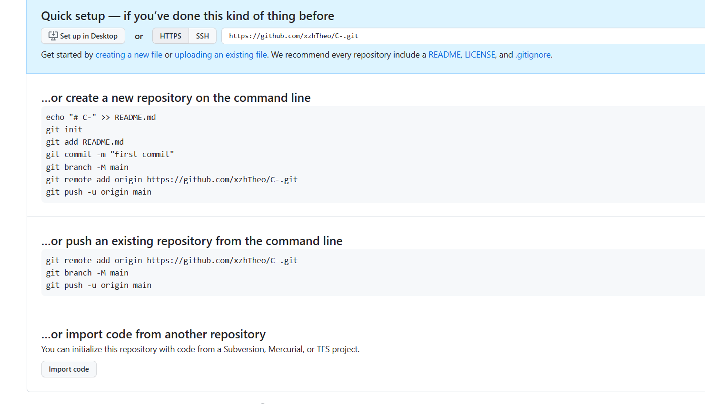
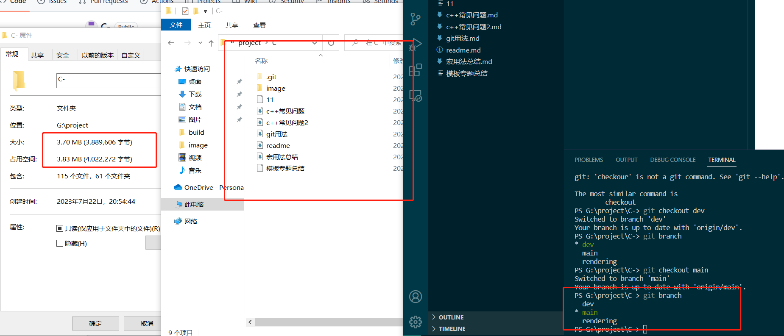
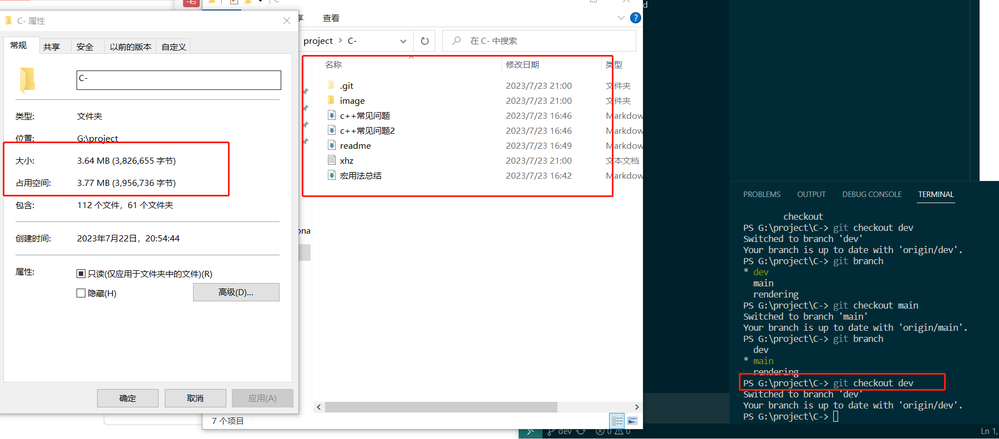
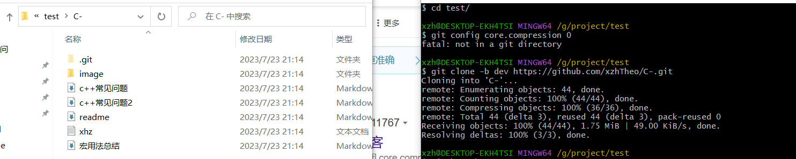
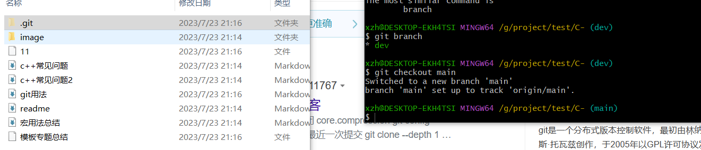

# git用法

### 新建远程分支

在创建github的新仓库时会给出如下提示:

-   git init
-   git add [README.md](http://README.md "README.md")
-   git commit -m "first commit"
-   git branch -M main
-   git remote add origin [https://github.com/helloyzp/AlgorithmProject.git](https://github.com/helloyzp/AlgorithmProject.git "https://github.com/helloyzp/AlgorithmProject.git")
-   git push -u origin main

有两条之前没介绍过的命令

git branch -M main           修改当前分支名字（之所以要修改，因为以前的master涉及黑人敏感）

git push -u origin main，以前是git push --set-upstream origin main，前者是后者的缩写版本

git push --set-upstream origin main 的作用是：
1.先把本地的当前分支推送到远程仓库origin的main分支
2.然后把本地的当前分支关联到远程仓库origin的main分支
即相当于 git push origin main 加上 git branch --set-upstream-to=origin/main main的作用，即先把本地分支push到远程仓库中，然后再建立本地分支与远程分支的关联。

#### 删除远程分支

git push origin  :dev

git push origin --delete dev

#### git本地仓库一份代码，存储的多个分支？

是的，通过切换分支，在同一个文件夹下，原来main分支的部分不属于dev分支的内容消失了，只留下了他们的交集，并且内存也减小了。

#### git仓库不同分支代码不同，拉回本地某个分支的代码，整个仓库代码都在吗？

在的，如下图，去一个新的文件夹下拉去远程仓库的dev分支，看似之拉了dev分支，实际上整个仓库都在，只需要checkout一下

