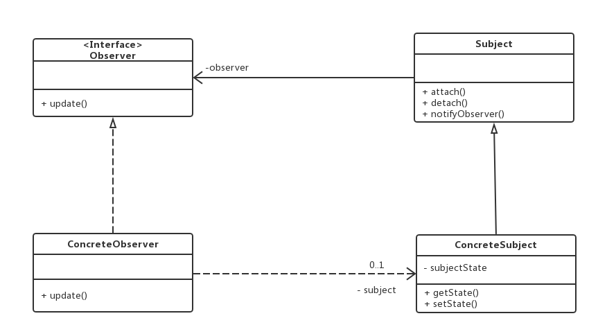

# 观察者模式

(1)问题：
一个对象的改变，及时的将通知广播给其他关注它的对象，(一对多的通知，例如地震发生了（被观察者），人跑了，楼塌了，上新闻了（观察者）)
(2)意图：
定义对象间的一种**一对多依赖关系**，使得**每当一个对象状态发生改变时，其相关依赖对象皆得到通知并被自动更新**。属于**行为型模式**。
(3)适用性：
• 当一个抽象模型有两个方面 , 其中一个方面依赖于另一方面。将这二者封装在独立的对象中以使它们可以各自独立地改变和复用。
• 当对一个对象的改变需要同时改变其它对象 , 而不知道具体有多少对象有待改变。
• 当一个对象必须通知其它对象，而它又不能假定其它对象是谁。换言之 , 你不希望这些对象是紧密耦合的。

在游戏中，你的所有类耦合度应该设计的很低。这意味着你的类应该能够彼此交互，[QQ号码购买平台](https://www.fgba.net/ "QQ号码购买平台")且彼此之间应该知道对方尽量少的内容。使得你的类具有低耦合度，使得你的游戏可以模块化和灵活性的添加新的功能，且不会有意外的错误。 &#x20;

此模式通常在对象想要向其订阅户（其他类对象）发送消息时实现。对象不需要知道订阅者如何工作，但是他们能相互通信。



-   被[观察者](https://www.zhihu.com/search?q=观察者\&search_source=Entity\&hybrid_search_source=Entity\&hybrid_search_extra={"sourceType":"article","sourceId":"25045567"} "观察者")(Subject)：知道它的通知对象，事件发生后会通知所有它知道的对象，提供添加删除观察者的接口。
-   观察者(Observer)：提供通知后的更新事件
-   具体被观察者(ConcreteSubject)：被观察者具体的实例，存储观察者感兴趣的状态。
-   具体观察者(ConcreteObserver)：观察者的具体实现。 &#x20;

```c++
#include <iostream>
#include <string.h>  
#include <stdio.h>
#include <vector>
#include <list>
using namespace std;
class ObserverInterface {
public:
    virtual void dosomething() = 0;
    virtual ~ObserverInterface() {}
};
class SubjectInterface {
public:
    virtual void Add(ObserverInterface* obr) = 0;
    virtual void Remove(ObserverInterface* obr) = 0;
    virtual void Notify() = 0;

    virtual ~SubjectInterface() {}
};
class earthquake :public SubjectInterface {
public:
    void Add(ObserverInterface* obr) override {
        observers.push_back(obr);
    }

    void Remove(ObserverInterface* obr) override {
        auto pos = std::find(observers.begin(), observers.end(), obr);
        if (pos != observers.end()) {
            observers.erase(pos);
        }
    }

    void Notify() override {
        for (const auto& obs : observers) {
            obs->dosomething();
        }
    }

private:
    std::list<ObserverInterface*> observers;
};

class peaple :public ObserverInterface {
public:
    void dosomething() override {
        std::cout << "快跑啊" << std::endl;
    }
};
class news :public  ObserverInterface {
public:
    void dosomething() override {
        std::cout << "***城市，发生了地震" << std::endl;
    }
};
class building :public  ObserverInterface {
public:
    void dosomething() override {
        std::cout << "轰轰，建筑轰然倒地" << std::endl;
    }
};
int main() {
    earthquake _earthquake;
    ObserverInterface* _peaple = new peaple;
    ObserverInterface* _news = new news;
    ObserverInterface* _building = new building;
    
    _earthquake.Add(_peaple);
    _earthquake.Add(_news);
    _earthquake.Add(_building);
    //下班了 发消息
    _earthquake.Notify();

    delete _peaple;
    delete _news;
    delete _building;
} 

```

参考：

[观察者模式（c++学习笔记） - 知乎 (zhihu.com)](https://zhuanlan.zhihu.com/p/119308881 "观察者模式（c++学习笔记） - 知乎 (zhihu.com)")

[https://zhuanlan.zhihu.com/p/25045567](https://zhuanlan.zhihu.com/p/25045567 "https://zhuanlan.zhihu.com/p/25045567") &#x20;

[漫画：什么是“观察者模式”？ - 知乎 (zhihu.com)](https://zhuanlan.zhihu.com/p/158537313 "漫画：什么是“观察者模式”？ - 知乎 (zhihu.com)")
